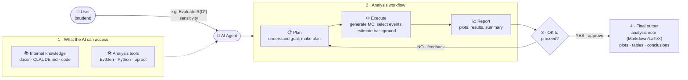

# Physics Analysis Agent — B → D\*τν Sensitivity Study

AI エージェントと一緒に進める、学部学生向けの B 中間子セミレプトニック崩壊
**B → D\*(→ Dπ) τν** の解析プロジェクト。
Belle II の公式サンプルは使わず、**EvtGen をローカル PC(macOS, Apple Silicon)で走らせて MC を自作**し、
ジェネレータレベル + 簡易検出器スメアリングで R(D\*) 測定の感度を学ぶ。

---

## 1. 物理背景

τ を含むセミレプトニック崩壊 B → D\*τν は、軽レプトンモード B → D\*ℓν (ℓ = e, μ) との比

$$R(D^*) = \frac{\mathcal{B}(B \to D^* \tau \nu)}{\mathcal{B}(B \to D^* \ell \nu)}$$

が標準模型で精密に予言できる(〜0.25)。実測値は長らく SM 予言より高めで、
**レプトン普遍性の破れ**(荷電 Higgs やレプトクォークの寄与)の兆候として注目されている。

崩壊はツリーレベルの b → c 遷移(W 放出):


τ は即座に崩壊してニュートリノを複数出すため、**τ モードは missing energy が大きい**。
そこで効く識別変数が:

| 変数 | 定義 | 特徴 |
|---|---|---|
| m²_miss | (p_B − p_D\* − p_ℓ)² | ℓν モードは 0 にピーク、τ モードは広く正側に分布 |
| p\*_ℓ | B 静止系でのレプトン運動量 | τ の二次レプトンは柔らかい |
| q² | (p_B − p_D\*)² | τ モードは質量閾値のため高 q² 側 |

---

## 2. AI エージェントのワークフロー

このリポジトリは「AI for Physics」エージェントの実験場でもある。
エージェントは以下のループで解析を進め、**各ステップでユーザー(学生)の承認**を得る。



エージェントへの指示・規約は [CLAUDE.md](CLAUDE.md) に集約(図の *Internal Knowledge* に相当)。

---

## 3. リポジトリ構成

```
phys_agent/
├── README.md               # このファイル(全体のインストラクション)
├── CLAUDE.md               # AI エージェント用の規約・物理コンベンション
├── docs/
│   └── figures/            # ファインマン図などの図版
├── generation/             # MC 生成(EvtGen)
│   ├── dec/                # ユーザー decay ファイル
│   │   ├── B0_Dsttaunu.dec   # signal:        B0 → D*∓ τ± ν
│   │   └── B0_Dstmunu.dec    # normalization: B0 → D*∓ μ± ν
│   ├── src/generate.cc     # EvtGen ドライバ(HepMC3 出力)
│   └── build.sh            # コンパイルスクリプト
├── scripts/
│   └── env.sh              # conda 環境のアクティベート
├── analysis/
│   └── plot_m2miss.py      # 真値レベルの m²_miss / p*_ℓ / q² 分布
├── fastsim/                # 簡易検出器スメアリング(Phase 2)
├── data/                   # 生成した MC(git 管理外)
└── plots/                  # 出力プロット
```

---

## 4. セットアップ

conda-forge の EvtGen(osx-arm64 対応)を使う。**フル検出器シミュレーション(basf2/Geant4)は不要。**

```bash
conda create -y -n physagent -c conda-forge evtgen pyhepmc uproot awkward numpy matplotlib-base cxx-compiler
```

以後の作業は毎回:

```bash
source scripts/env.sh
```

---

## 5. MC 生成

Υ(4S) → B0 B̄0 を生成し、片方の B を signal 崩壊にフォース(標準的な `B0sig` エイリアス方式)。
反対側 B は EvtGen 付属の `DECAY.DEC` に従って generic に崩壊する。
Υ(4S) には Belle II 相当のブースト(E_HER=7, E_LER=4 GeV, 近似的に pz ≈ 3 GeV)を与える。

```bash
bash generation/build.sh             # コンパイル(初回のみ)
./generation/bin/generate generation/dec/B0_Dsttaunu.dec 5000 data/signal_taunu.hepmc 1 generation/dec/tau_native.dec
./generation/bin/generate generation/dec/B0_Dstmunu.dec  5000 data/norm_munu.hepmc   2 generation/dec/tau_native.dec
```

> **Note**: conda-forge の osx-arm64 ビルドでは Tauola++ が初期化時にクラッシュする
> (`STOP IN APKMAS`)ため、Tauola は使わず τ 崩壊は EvtGen ネイティブモデル
> ([tau_native.dec](generation/dec/tau_native.dec)、DECAY_2010.DEC 由来)で記述している。
> ドライバも Photos/Pythia のみを手動でセットアップする。

崩壊チェーン(v1 では再構成を簡単にするためフォース):

- **Signal**: B0 → D\*⁻ τ⁺ ν_τ,  D\*⁻ → D̄0 π⁻,  D̄0 → K⁺ π⁻,  τ⁺ → μ⁺ ν ν̄
- **Norm**: B0 → D\*⁻ μ⁺ ν_μ,  同じ D\* チェーン
- form factor は v1 は ISGW2(後で BGL/CLN に更新予定)

## 6. 解析(Phase 1: 真値レベル)

```bash
python analysis/plot_m2miss.py data/signal_taunu.hepmc data/norm_munu.hepmc
```

m²_miss, p\*_ℓ, q² の signal vs normalization 比較プロットを `plots/` に出力する。
ℓν モードの m²_miss が 0 にピークし、τν モードが正側に裾を引くことを確認するのが最初のマイルストーン。

最初の結果(5000 イベント / モード、真値レベル):

| | |
|---|---|
|  |  |

μν モードの m²_miss は 0 に鋭くピークし、τν モードはニュートリノ 3 本のため広く正側に分布。
p\*_ℓ も τ の二次ミューオンが柔らかいことがはっきり見える。

## 7. ロードマップ

- [x] **Phase 1**: EvtGen ローカル生成 + 真値レベルの識別変数分布
- [ ] **Phase 2**: fast sim(運動量分解能・アクセプタンス・効率のスメアリング)
- [ ] **Phase 3**: D\* 再構成 + ROE から missing 4-momentum → テンプレートフィットで R(D\*) 統計感度
- [ ] **Phase 4**: 背景モード追加(B → D\*\*ℓν, generic BB̄)、系統誤差の議論
- [ ] **Final**: 解析ノート(Markdown/LaTeX)自動生成

---

*Keisuke Yoshihara (kyoshiha@hawaii.edu) — undergraduate research training project, UH Mānoa*
