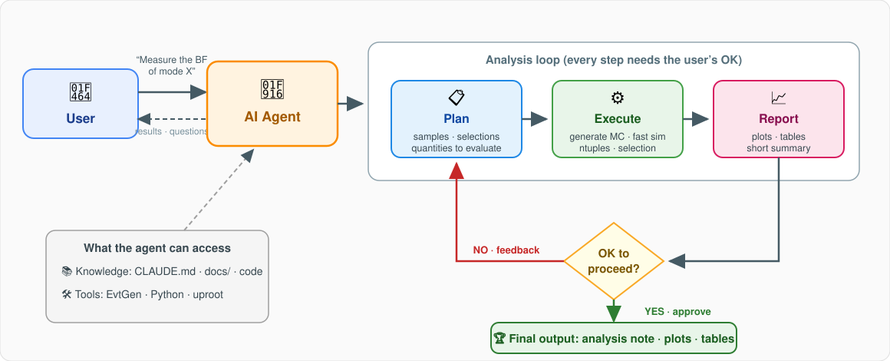
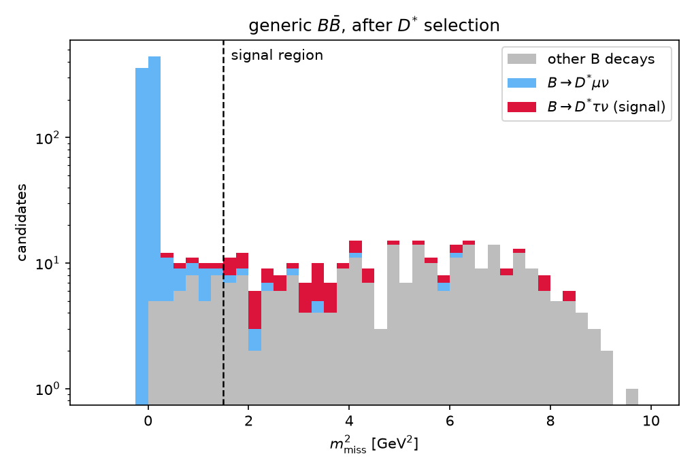

# Physics Analysis Agent

A framework for doing particle-physics analyses **together with an AI agent**,
developed as a student research training project. The agent is not tied to one
measurement: it is aimed at **any analysis that fits the pipeline below** —
and it is best suited (at least at first) to **relatively simple analyses,
such as branching-fraction measurements**, where the workflow is
well-defined: generate MC, simulate the detector response, build ntuples,
optimize a selection, count events.

```
EvtGen MC generation  →  fast detector simulation  →  ROOT ntuples (uproot)
                      →  selection optimization    →  result (e.g. BF)
```

Everything runs **locally on a laptop** (macOS, Apple Silicon) — no
experiment framework, no full detector simulation, no ROOT C++ installation.
The pipeline is **mode-agnostic**: adding a new decay mode is a matter of
adding an EvtGen dec file. A complete worked example
(B0 → D\*τν, section 8) shows every step end to end.

---

## 1. AI-agent workflow

The agent advances an analysis in the loop below, with **user (student)
approval at each step**.



Instructions and conventions for the agent are collected in
[CLAUDE.md](CLAUDE.md) (the *Knowledge* item in the figure).

A skeleton implementation of this loop lives in [agent/](agent/README.md):
an LLM drives the pipeline below through typed tools
(`generate_mc`, `make_ntuple`, `query_ntuple`, `plot_variable`), with the
approval gate implemented as a tool the model must call first. Try it with

```bash
pip install anthropic   # once; needs an Anthropic API key
python -m agent "Compare m2_miss between B0 -> D* tau nu and B0 -> D* mu nu"
```

---

## 2. Repository layout

```
phys_agent/
├── README.md               # this file (overall instructions)
├── CLAUDE.md               # AI-agent conventions and physics conventions
├── docs/
│   └── figures/            # Feynman diagrams and report figures
├── generation/             # MC generation (EvtGen)
│   ├── dec/                # user decay files, one per mode (see section 4)
│   ├── src/generate.cc     # EvtGen driver (HepMC3 output)
│   └── build.sh            # build script
├── scripts/
│   └── env.sh              # conda environment activation
├── fastsim/                # simple detector response (see section 5)
│   ├── smear.py            # detector model (resolution, acceptance, efficiency)
│   ├── apply_fastsim.py    # smearing + truth-vs-smeared comparison plots
│   └── make_ntuple.py      # fast sim -> flat ROOT ntuple (uproot)
├── analysis/
│   └── plot_m2miss.py      # truth-level plots for the worked example
├── data/                   # generated MC and ntuples (not tracked by git)
└── plots/                  # output plots
```

---

## 3. Setup

We use EvtGen from conda-forge (osx-arm64 supported). **No full detector
simulation (basf2/Geant4) is needed.**

```bash
conda create -y -n physagent -c conda-forge evtgen pyhepmc uproot awkward numpy matplotlib-base cxx-compiler
```

Then, at the start of every session:

```bash
source scripts/env.sh
```

---

## 4. MC generation

The driver generates Υ(4S) → BB̄ with a Belle II-like boost
(E_HER = 7, E_LER = 4 GeV, approximately pz ≈ 3 GeV). One B is forced into
the decay chain of interest via the standard `sig` alias approach in the dec
file; the other B decays generically according to the DECAY.DEC shipped with
EvtGen.

```bash
bash generation/build.sh             # compile (first time only)
./generation/bin/generate <dec file> <nEvents> <out.hepmc> <seed> generation/dec/tau_native.dec
```

Available modes (each dec file forces a fully reconstructable chain; add a
dec file to add a mode):

| dec file | Mode | Model |
|---|---|---|
| `B0_Dsttaunu.dec` | B0 → D\*⁻τ⁺ν, τ → μνν | ISGW2 |
| `B0_Dstmunu.dec` | B0 → D\*⁻μ⁺ν | ISGW2 |
| `B0_Dststmunu.dec` | B0 → D\*\*μν, D\*\* → D\*π0 (D₁, D₂\*) | ISGW2 |
| `B_DsstKstmunu.dec` | B⁻ → D_s\*⁺K\*⁻μν | PHSP |
| `B_DsK1munu.dec` | B⁻ → D_s⁺K₁(1270)⁻μν | PHSP |
| `B_Ds1Kmunu.dec` | B⁻ → D_s1(2536)⁺K⁻μν | PHSP |
| `generic_bbbar.dec` | generic Υ(4S) → BB̄ (nothing forced) | DECAY.DEC |

Example (the worked-example samples):

```bash
./generation/bin/generate generation/dec/B0_Dsttaunu.dec  5000 data/signal_taunu.hepmc  1 generation/dec/tau_native.dec
./generation/bin/generate generation/dec/B0_Dstmunu.dec   5000 data/norm_munu.hepmc     2 generation/dec/tau_native.dec
./generation/bin/generate generation/dec/B0_Dststmunu.dec 5000 data/bkg_dststmunu.hepmc 3 generation/dec/tau_native.dec
```

Generation is fast (~2000 events/s) and HepMC ascii files take ~6 KB/event,
so samples are **regenerated on demand from fixed seeds** rather than stored
or committed. 4-body semileptonic decays use PHSP (EvtGen has no dedicated
form-factor model for those topologies); forced-mode samples give signal and
background **shapes**, with absolute normalization applied at analysis time.
Continuum e⁺e⁻ → qq̄ is not simulated (EvtGen alone cannot).

> **Note**: The conda-forge osx-arm64 build of Tauola++ crashes at
> initialization (`STOP IN APKMAS`), so we do not use Tauola; τ decays are
> described with EvtGen native models
> ([tau_native.dec](generation/dec/tau_native.dec), taken from
> DECAY_2010.DEC). The driver sets up only Photos and Pythia by hand.

---

## 5. Fast detector simulation

Instead of a full detector simulation, the simple Belle II-like detector
model in `fastsim/smear.py` is applied to every charged track:

| Effect | Model |
|---|---|
| Momentum resolution | σ_p/p = 0.5% (Gaussian; direction unchanged, E recomputed from the true mass) |
| Acceptance | 17° < θ_lab < 150° (Belle II CDC-like) |
| Tracking efficiency | 95% per track, flat in p and θ |

Events in which any signal-chain track is lost are discarded as
reconstruction failures. The detector model is deliberately minimal and
lives in one dataclass — refining it (p/θ-dependent resolution, particle ID,
neutrals) is itself a good student project.

---

## 6. Ntuple production

`fastsim/make_ntuple.py` runs the fast simulation and writes one row per
reconstructed candidate to a ROOT file with **uproot** (pure Python — no
ROOT C++ installation needed):

```bash
python fastsim/make_ntuple.py <in.hepmc> <out.root> <mode_id> <seed>
```

Branches (smeared unless noted): `m2miss`, `plep_star`, `q2`, `m_d0`,
`delta_m`, `p_lep_lab`, `costh_lep_lab`, `p_dst_lab`,
`m2miss_true`, `plep_star_true`, `q2_true`, `mode_id`, `event`.

Read them back with:

```python
import uproot
events = uproot.open("data/signal_taunu.root")["events"].arrays(library="np")
```

`mode_id` is a per-sample label chosen on the command line, so ntuples from
different samples can be concatenated and still identified. The candidate
finder currently targets D\* chains; generalizing it to the charged-B / D_s
modes is a roadmap item.

---

## 7. Analysis pattern: a branching-fraction measurement

Every BF measurement follows the same steps, all starting from the ntuples:

1. **Samples**: signal mode, normalization/control modes, dominant
   backgrounds (each a dec file + one `make_ntuple.py` run).
2. **Selection**: choose cuts on the ntuple variables and optimize a figure
   of merit (e.g. S/√(S+B)).
3. **Count and correct**: count events in the signal region, correct for the
   reconstruction efficiency (from the same ntuples), and convert to a BF
   using N_BB and the known sub-mode branching fractions.
4. **Report**: plots + a short note with the numbers in tables.

The agent prepares samples and infrastructure; **steps 2–4 are the
student's analysis**.

---

## 8. Worked example: B0 → D\*τν

The full chain has been exercised on the semitauonic decay B0 → D\*τν,
with B0 → D\*μν as normalization. (This ratio is the well-known
R(D\*) = B(B → D\*τν)/B(B → D\*ℓν), a long-standing hint of
lepton-flavor-universality violation — but here it simply serves as a
worked example with interesting kinematics.)


Because the τ decays promptly and produces multiple neutrinos, **the τ mode
has large missing energy**. The discriminating variables are:

| Variable | Definition | Feature |
|---|---|---|
| m²_miss | (p_B − p_D\* − p_ℓ)² | ℓν modes peak at 0; τ modes spread to positive values |
| p\*_ℓ | lepton momentum in the B rest frame | secondary leptons from τ are soft |
| q² | (p_B − p_D\*)² | τ modes sit at high q² due to the mass threshold |

### Truth level (Phase 1)

```bash
python analysis/plot_m2miss.py data/signal_taunu.hepmc data/norm_munu.hepmc
```

| | |
|---|---|
|  |  |

The μν mode peaks sharply at m²_miss = 0, while the τν mode is broad and
positive because of the three neutrinos. In p\*_ℓ the secondary muon from
the τ is clearly softer.

### After fast simulation (Phase 2)

```bash
python fastsim/apply_fastsim.py data/signal_taunu.hepmc data/norm_munu.hepmc 42
```

| Mode | Reconstruction efficiency | Breakdown (approx.) |
|---|---|---|
| B → D\*τν (signal) | 59.2% | acceptance × (0.95)⁴ ≈ 0.73 × 0.81 |
| B → D\*μν (norm.) | 61.3% | same |

| | |
|---|---|
|  |  |

The μν-mode m²_miss peak, delta-like at truth level, broadens to
σ ≈ 0.07 GeV² after smearing — still orders of magnitude narrower than the
broad τν distribution, so the discriminating power survives. p\*_ℓ and q²
are essentially unchanged (their widths are physics-dominated).

### Ntuples with the dominant background (Phase 3a)

| mode_id | Sample | Role |
|---|---|---|
| 0 | B0 → D\*τν, τ → μνν | signal |
| 1 | B0 → D\*μν | normalization (and bkg via resolution tail) |
| 2 | B0 → D\*\*μν, D\*\* → D\*π0 | dominant background (semileptonic feed-down) |

```bash
python fastsim/make_ntuple.py data/signal_taunu.hepmc   data/signal_taunu.root   0 42
python fastsim/make_ntuple.py data/norm_munu.hepmc      data/norm_munu.root      1 43
python fastsim/make_ntuple.py data/bkg_dststmunu.hepmc  data/bkg_dststmunu.root  2 44
```

| | |
|---|---|
|  |  |

The D\*\*μν background peaks at m²_miss ≈ 0.3–1 GeV² (one missed π0),
between the normalization peak and the broad signal distribution.

### First-pass BF measurement (Phase 3b)

A complete counting analysis on 10⁶ generic BB̄ events treated as the
dataset ( `analysis/measure_bf_dsttaunu.py`; the `true_mode` ntuple branch
labels each candidate's true B decay):

```bash
# 5 x 200k generic events (see section 4), then:
python analysis/measure_bf_dsttaunu.py --signal data/signal_taunu.root \
    --data data/generic_*.root --n-sig-gen 5000 --n-b0 <N> --truth-taunu <N>
```

| Quantity | Value |
|---|---|
| Selection | \|m_D0 − 1.865\| < 20 MeV, \|Δm − 145.4\| < 2.5 MeV, m²_miss > 1.5 GeV² |
| Efficiency (signal MC) | 49.4 ± 0.7 % |
| Candidates in SR | 285 (background 242, MC truth) |
| **B(B0 → D\*τν)** | **(1.97 ± 1.05 (stat)) %** |
| Generator truth | 1.48 % → closure at +0.5σ |



**Student tasks**: replace the MC-truth background subtraction with a
sideband/control-region method; improve S/√(S+B) ≈ 2.5 (the background is
flat in m²_miss — tag-side information is needed, which motivates Phase 4);
study the luminosity needed for a 10% measurement.

---

## 9. Roadmap

- [x] **Phase 1**: local EvtGen generation + truth-level distributions (worked example)
- [x] **Phase 2**: fast sim (momentum resolution, acceptance, efficiency smearing)
- [x] **Phase 3a**: background sample + ROOT ntuple production (uproot)
- [ ] **Phase 3b**: selection optimization + branching-fraction extraction (student task)
- [ ] **Phase 4**: generalize the ntuple producer to the charged-B / D_s modes; generic BB̄ background; systematics
- [ ] **Final**: automated analysis note (Markdown/LaTeX) per measured mode

---

## License

This project is licensed under the [GNU GPL v3](LICENSE). The τ decay table
[tau_native.dec](generation/dec/tau_native.dec) is derived from DECAY_2010.DEC
shipped with [EvtGen](https://evtgen.hepforge.org/), which is itself GPL-3.0.

---

*Keisuke Yoshihara (kyoshiha@hawaii.edu) — undergraduate research training project, UH Mānoa*
