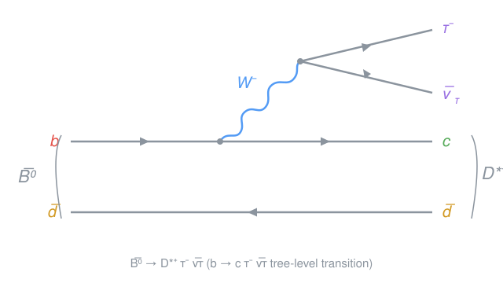
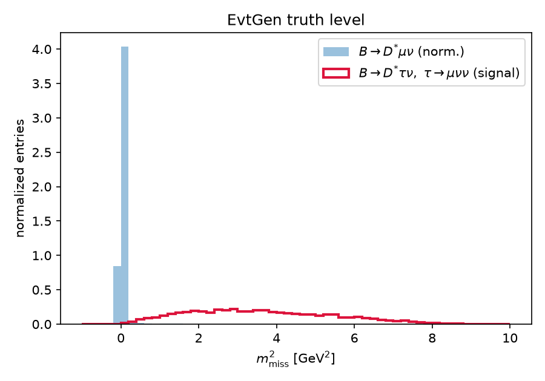
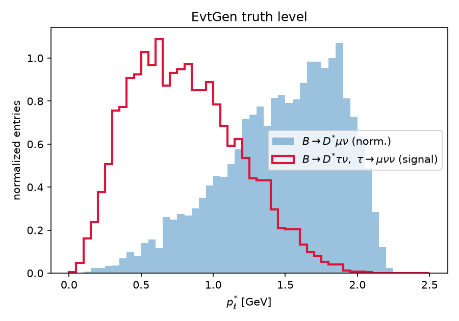
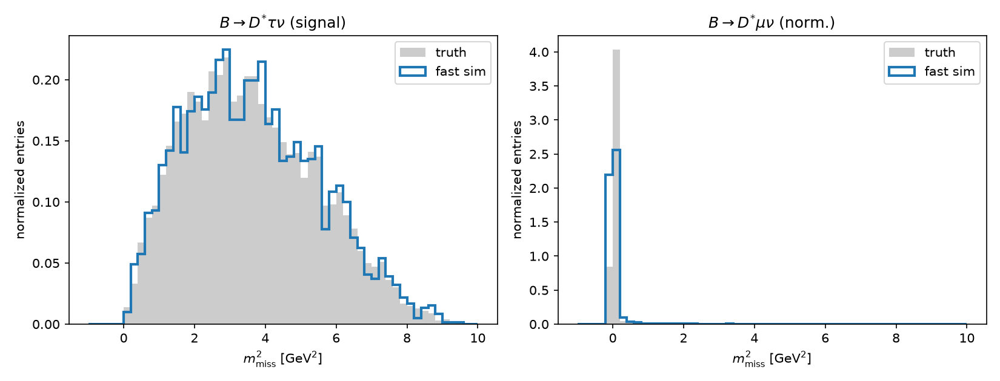
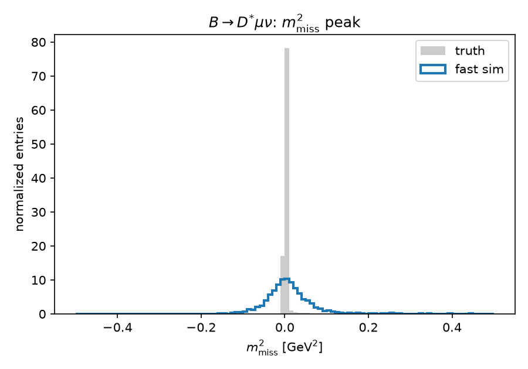
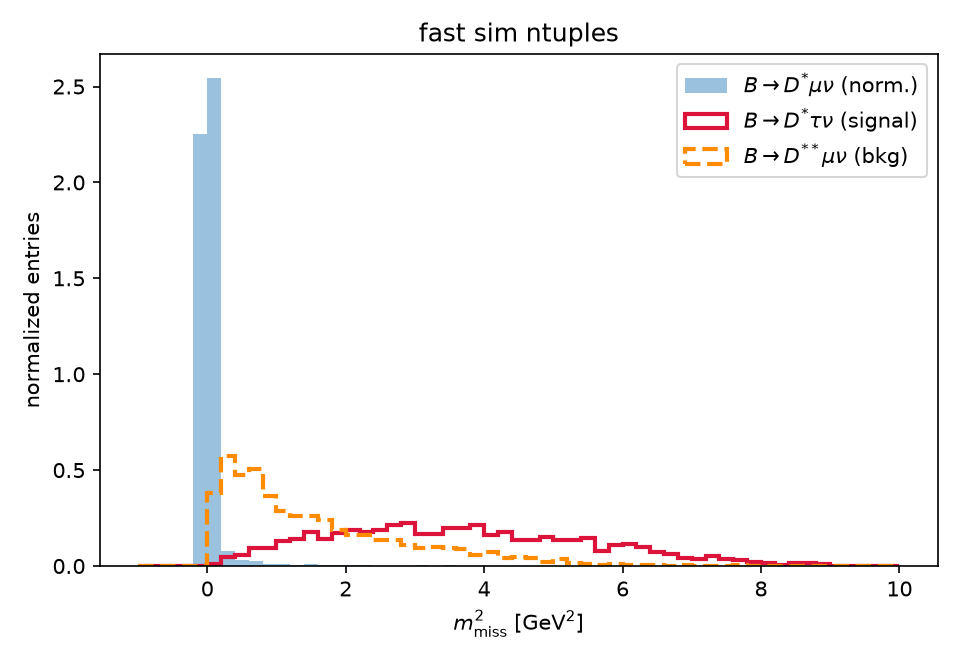
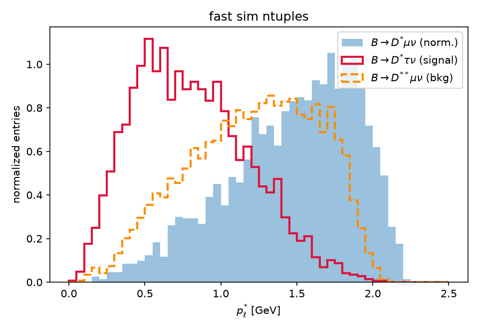

# Physics Analysis Agent — Semileptonic B Branching-Fraction Framework

A student research project, carried out together with an AI agent, that builds
a **framework for measuring branching fractions of semileptonic B-meson
decays**: EvtGen MC generation → fast detector simulation → ROOT ntuples →
selection and BF extraction. Instead of official Belle II samples, we **run
EvtGen locally on a laptop (macOS, Apple Silicon) to produce our own MC**.
The pipeline is mode-agnostic — adding a decay mode is a matter of adding a
dec file. **B → D\*(→ Dπ) τν** serves as the first worked example.

---

## 1. Physics background (worked example: B → D\*τν)

The semitauonic decay B → D\*τν is compared with the light-lepton modes
B → D\*ℓν (ℓ = e, μ) through the ratio

$$R(D^{\ast}) = \frac{\mathcal{B}(B \to D^{\ast} \tau \nu)}{\mathcal{B}(B \to D^{\ast} \ell \nu)}$$

which is precisely predicted in the Standard Model (~0.25). Measured values
have long sat above the SM prediction, making this a well-known hint of
**lepton-flavor-universality violation** (charged Higgs or leptoquark
contributions).

The decay is a tree-level b → c transition (W emission):



Because the τ decays promptly and produces multiple neutrinos, **the τ mode
has large missing energy**. The discriminating variables are:

| Variable | Definition | Feature |
|---|---|---|
| m²_miss | (p_B − p_D\* − p_ℓ)² | ℓν modes peak at 0; τ modes spread to positive values |
| p\*_ℓ | lepton momentum in the B rest frame | secondary leptons from τ are soft |
| q² | (p_B − p_D\*)² | τ modes sit at high q² due to the mass threshold |

---

## 2. AI-agent workflow

This repository doubles as a testbed for an "AI for Physics" agent.
The agent advances the analysis in the loop below, with **user (student)
approval at each step**.


Instructions and conventions for the agent are collected in
[CLAUDE.md](CLAUDE.md) (the *Internal Knowledge* box in the figure).

---

## 3. Repository layout

```
phys_agent/
├── README.md               # this file (overall instructions)
├── CLAUDE.md               # AI-agent conventions and physics conventions
├── docs/
│   └── figures/            # Feynman diagrams and report figures
├── generation/             # MC generation (EvtGen)
│   ├── dec/                # user decay files
│   │   ├── B0_Dsttaunu.dec   # signal:        B0 → D*∓ τ± ν
│   │   └── B0_Dstmunu.dec    # normalization: B0 → D*∓ μ± ν
│   ├── src/generate.cc     # EvtGen driver (HepMC3 output)
│   └── build.sh            # build script
├── scripts/
│   └── env.sh              # conda environment activation
├── analysis/
│   └── plot_m2miss.py      # truth-level m²_miss / p*_ℓ / q² distributions
├── fastsim/                # simple detector smearing (Phase 2)
│   ├── smear.py            # detector model (resolution, acceptance, efficiency)
│   └── apply_fastsim.py    # apply smearing + compare with truth
├── data/                   # generated MC (not tracked by git)
└── plots/                  # output plots
```

---

## 4. Setup

We use EvtGen from conda-forge (osx-arm64 supported). **No full detector
simulation (basf2/Geant4) is needed.**

```bash
conda create -y -n physagent -c conda-forge evtgen pyhepmc uproot awkward numpy matplotlib-base cxx-compiler
```

Then, at the start of every session:

```bash
source scripts/env.sh
```

---

## 5. MC generation

Generate Υ(4S) → B0 B̄0 and force one B into the signal decay (the standard
`B0sig` alias approach). The other B decays generically according to the
DECAY.DEC shipped with EvtGen. The Υ(4S) is given a Belle II-like boost
(E_HER = 7, E_LER = 4 GeV, approximately pz ≈ 3 GeV).

```bash
bash generation/build.sh             # compile (first time only)
./generation/bin/generate generation/dec/B0_Dsttaunu.dec 5000 data/signal_taunu.hepmc 1 generation/dec/tau_native.dec
./generation/bin/generate generation/dec/B0_Dstmunu.dec  5000 data/norm_munu.hepmc   2 generation/dec/tau_native.dec
```

> **Note**: The conda-forge osx-arm64 build of Tauola++ crashes at
> initialization (`STOP IN APKMAS`), so we do not use Tauola; τ decays are
> described with EvtGen native models
> ([tau_native.dec](generation/dec/tau_native.dec), taken from
> DECAY_2010.DEC). The driver sets up only Photos and Pythia by hand.

Decay chains (forced in v1 to keep the reconstruction simple):

- **Signal**: B0 → D\*⁻ τ⁺ ν_τ,  D\*⁻ → D̄0 π⁻,  D̄0 → K⁺ π⁻,  τ⁺ → μ⁺ ν ν̄
- **Norm**: B0 → D\*⁻ μ⁺ ν_μ,  same D\* chain
- Form factor: ISGW2 in v1 (to be updated to BGL/CLN later)

### Further modes

The framework is not limited to B → D\*ℓν. Additional dec files cover
charged-B semileptonic modes with a D_s or excited kaons in the final state,
plus a fully generic BB̄ sample; 4-body semileptonic decays use the PHSP
model (no dedicated form-factor model exists in EvtGen for these
topologies). All sub-decays are forced to fully charged final states where
possible.

```bash
./generation/bin/generate generation/dec/B_DsstKstmunu.dec 5000 data/sig_dsstkst.hepmc  10 generation/dec/tau_native.dec   # B- -> D_s*+ K*- mu nu
./generation/bin/generate generation/dec/B_DsK1munu.dec    5000 data/sig_dsk1.hepmc     11 generation/dec/tau_native.dec   # B- -> D_s+ K_1(1270)- mu nu
./generation/bin/generate generation/dec/B_Ds1Kmunu.dec    5000 data/sig_ds1k.hepmc     12 generation/dec/tau_native.dec   # B- -> D_s1(2536)+ K- mu nu
./generation/bin/generate generation/dec/generic_bbbar.dec 20000 data/generic_bbbar.hepmc 13 generation/dec/tau_native.dec # generic Y(4S) -> B Bbar
```

Generation is fast (~2000 events/s) and HepMC ascii files take ~6 KB/event,
so samples are regenerated on demand from the fixed seeds rather than stored
or committed.

## 6. Analysis (Phase 1: truth level)

```bash
python analysis/plot_m2miss.py data/signal_taunu.hepmc data/norm_munu.hepmc
```

Produces signal vs normalization comparison plots of m²_miss, p\*_ℓ, and q²
in `plots/`. The first milestone is to confirm that the ℓν mode peaks at
m²_miss = 0 while the τν mode develops a broad positive tail.

First results (5000 events / mode, truth level):

| | |
|---|---|
|  |  |

The μν mode peaks sharply at m²_miss = 0, while the τν mode is broad and
positive because of the three neutrinos. In p\*_ℓ the secondary muon from the
τ is clearly softer.

## 7. Fast simulation (Phase 2: detector smearing)

Instead of a full detector simulation, the simple detector model in
`fastsim/smear.py` smears the charged tracks (K, π, slow π, μ):

| Effect | Model |
|---|---|
| Momentum resolution | σ_p/p = 0.5% (Gaussian; direction unchanged, E recomputed from the true mass) |
| Acceptance | 17° < θ_lab < 150° (Belle II CDC-like) |
| Tracking efficiency | 95% per track, flat in p and θ |

The D\* is reconstructed as the sum of the three smeared tracks (K, π,
slow π), and p_B is taken from truth (a stand-in for the beam / B_tag
constraint until Phase 3). Events in which any of the four tracks is lost
are discarded as reconstruction failures.

```bash
python fastsim/apply_fastsim.py data/signal_taunu.hepmc data/norm_munu.hepmc 42
```

Results (5000 events / mode, seed 42):

| Mode | Reconstruction efficiency | Breakdown (approx.) |
|---|---|---|
| B → D\*τν (signal) | 59.2% | acceptance × (0.95)⁴ ≈ 0.73 × 0.81 |
| B → D\*μν (norm.) | 61.3% | same |

| | |
|---|---|
|  |  |

The μν-mode m²_miss peak, delta-like at truth level, broadens to
σ ≈ 0.07 GeV² after smearing. That is still orders of magnitude narrower
than the broad τν distribution (several GeV²), so the discriminating power
of m²_miss largely survives. p\*_ℓ and q² are essentially unchanged by the
0.5% momentum resolution, since their widths are physics-dominated and far
larger than the resolution.

## 8. Ntuple production (Phase 3: samples for the branching-fraction analysis)

Phase 3 is a simple **branching-fraction (counting) analysis** of
B0 → D\*τν. The agent provides the samples and the ntuple-production
script; **selection optimization and the BF extraction are the student's
task**, starting from flat ROOT ntuples.

### Samples

| mode_id | Sample | Role | dec file |
|---|---|---|---|
| 0 | B0 → D\*τν, τ → μνν | signal | `B0_Dsttaunu.dec` |
| 1 | B0 → D\*μν | normalization (and bkg via resolution tail) | `B0_Dstmunu.dec` |
| 2 | B0 → D\*\*μν, D\*\* → D\*π0 (D₁, D₂\*) | dominant background (semileptonic feed-down) | `B0_Dststmunu.dec` |

The D\*\* sample forces the narrow states D₁(2420) and D₂\*(2460) into
D\*⁻π0, so every event contains the same reconstructable K π π chain as the
signal; the missed π0 shifts m²_miss to positive values. Forced-mode samples
give background **shapes**, not absolute normalization. Continuum
e⁺e⁻ → qq̄ is not simulated (EvtGen alone cannot; noted as a limitation).

```bash
./generation/bin/generate generation/dec/B0_Dststmunu.dec 5000 data/bkg_dststmunu.hepmc 3 generation/dec/tau_native.dec
```

### Ntuples

`fastsim/make_ntuple.py` runs the fast simulation and writes one row per
reconstructed candidate to a ROOT file with **uproot** (pure Python — no
ROOT C++ installation needed):

```bash
python fastsim/make_ntuple.py data/signal_taunu.hepmc   data/signal_taunu.root   0 42
python fastsim/make_ntuple.py data/norm_munu.hepmc      data/norm_munu.root      1 43
python fastsim/make_ntuple.py data/bkg_dststmunu.hepmc  data/bkg_dststmunu.root  2 44
```

Branches (smeared unless noted): `m2miss`, `plep_star`, `q2`, `m_d0`,
`delta_m`, `p_lep_lab`, `costh_lep_lab`, `p_dst_lab`,
`m2miss_true`, `plep_star_true`, `q2_true`, `mode_id`, `event`.

Read them back with:

```python
import uproot
events = uproot.open("data/signal_taunu.root")["events"].arrays(library="np")
```

Reconstruction efficiencies (5000 events / mode): signal 59.2%,
normalization 61.2%, D\*\*μν 59.8%.

| | |
|---|---|
|  |  |

The D\*\*μν background peaks at m²_miss ≈ 0.3–1 GeV² (one missed π0),
between the normalization peak and the broad signal distribution — exactly
the feed-down structure seen in the Belle/Belle II R(D\*) analyses.

### Student tasks (from the ntuples)

1. Choose selections on `delta_m`, `m_d0`, `plep_star`, … and optimize a
   figure of merit (e.g. S/√(S+B)) for the signal region in m²_miss.
2. Count events, correct for efficiency, and extract
   B(B0 → D\*τν) assuming known N_BB and sub-mode branching fractions.

## 9. Roadmap

- [x] **Phase 1**: local EvtGen generation + truth-level discriminating variables
- [x] **Phase 2**: fast sim (momentum resolution, acceptance, efficiency smearing)
- [x] **Phase 3a**: D\*\*μν background sample + ROOT ntuple production (uproot)
- [ ] **Phase 3b**: selection optimization + branching-fraction extraction (student task)
- [ ] **Phase 4**: generalize the ntuple producer to the charged-B / D_s modes; generic BB̄ background; systematics
- [ ] **Final**: automated analysis note (Markdown/LaTeX) per measured mode

---

## License

This project is licensed under the [GNU GPL v3](LICENSE). The τ decay table
[tau_native.dec](generation/dec/tau_native.dec) is derived from DECAY_2010.DEC
shipped with [EvtGen](https://evtgen.hepforge.org/), which is itself GPL-3.0.

---

*Keisuke Yoshihara (kyoshiha@hawaii.edu) — undergraduate research training project, UH Mānoa*
