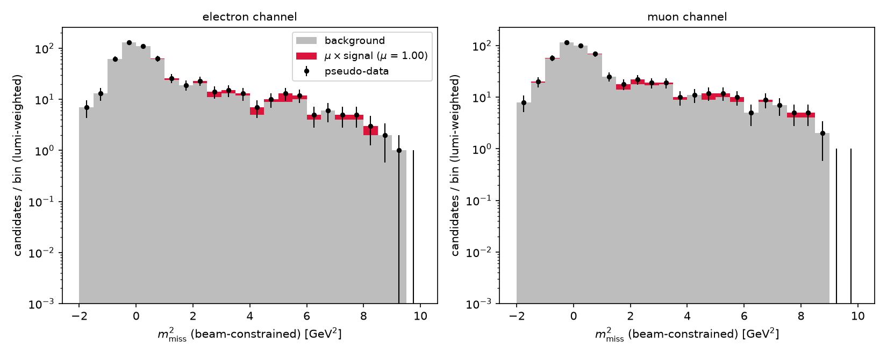
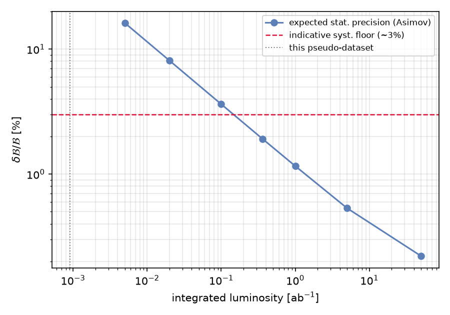
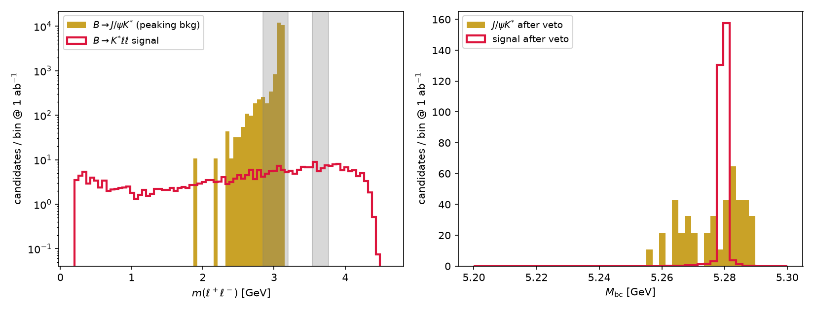

# Demonstrations

Two complete end-to-end demonstrations of the pipeline. Everything here is
reproducible from the fixed seeds shown in the commands; nothing generated
is committed. See the README for the framework itself.

## Worked example: B0 → D\*τν

The full chain has been exercised on the semitauonic decay B0 → D\*τν,
with B0 → D\*μν as normalization. (This ratio is the well-known
R(D\*) = B(B → D\*τν)/B(B → D\*ℓν), a long-standing hint of
lepton-flavor-universality violation — but here it simply serves as a
worked example with interesting kinematics.)


Because the τ decays promptly and produces multiple neutrinos, **the τ mode
has large missing energy**. The discriminating variables are:

| Variable | Definition | Feature |
|---|---|---|
| m²_miss | (p_B − p_D\* − p_ℓ)² | ℓν modes peak at 0; τ modes spread to positive values |
| p\*_ℓ | lepton momentum in the B rest frame | secondary leptons from τ are soft |
| q² | (p_B − p_D\*)² | τ modes sit at high q² due to the mass threshold |

### Truth level

```bash
python analysis/plot_m2miss.py data/signal_taunu.hepmc data/norm_lnu.hepmc
```

| | |
|---|---|
|  |  |

The μν mode peaks sharply at m²_miss = 0, while the τν mode is broad and
positive because of the three neutrinos. In p\*_ℓ the secondary muon from
the τ is clearly softer.

### After fast simulation

```bash
python fastsim/apply_fastsim.py data/signal_taunu.hepmc data/norm_lnu.hepmc 42
```

| Mode | Reconstruction efficiency | Breakdown (approx.) |
|---|---|---|
| B → D\*τν (signal) | 59.2% | acceptance × (0.95)⁴ ≈ 0.73 × 0.81 |
| B → D\*μν (norm.) | 61.3% | same |

| | |
|---|---|
|  |  |

The μν-mode m²_miss peak, delta-like at truth level, broadens to
σ ≈ 0.07 GeV² after smearing — still orders of magnitude narrower than the
broad τν distribution, so the discriminating power survives. p\*_ℓ and q²
are essentially unchanged (their widths are physics-dominated).

### Ntuples with the dominant background

| mode_id | Sample | Role |
|---|---|---|
| 0 | B0 → D\*τν, τ → ℓνν (ℓ = e, μ) | signal |
| 1 | B0 → D\*ℓν | normalization (and bkg via resolution tail) |
| 2 | B0 → D\*\*ℓν, D\*\* → D\*π0 | dominant background (semileptonic feed-down) |

```bash
./generation/bin/generate generation/dec/B0_Dststlnu.dec 5000 data/bkg_dststlnu.hepmc 3 generation/dec/tau_native.dec
python fastsim/make_ntuple.py data/signal_taunu.hepmc   data/signal_taunu.root   0 42
python fastsim/make_ntuple.py data/norm_lnu.hepmc       data/norm_lnu.root       1 43
python fastsim/make_ntuple.py data/bkg_dststlnu.hepmc   data/bkg_dststlnu.root   2 44
```

| | |
|---|---|
|  |  |

The D\*\*μν background peaks at m²_miss ≈ 0.3–1 GeV² (one missed π0),
between the normalization peak and the broad signal distribution.

### BF measurement

A complete counting analysis on a **luminosity-matched pseudo-dataset**:
10⁶ generic BB̄ events + 2.4 × 10⁶ continuum events
(`analysis/measure_bf_dsttaunu.py`; the `true_mode` branch labels each
candidate's origin):

```bash
python analysis/measure_bf_dsttaunu.py --signal data/signal_taunu.root \
    --data data/generic_*.root --continuum data/continuum_*.root \
    --cont-weight 0.995 --n-sig-gen 5000 --n-b0 <N> --truth-taunu <N>
```

| Quantity | Value |
|---|---|
| Selection | \|m_D0 − 1.865\| < 20 MeV, \|Δm − 145.4\| < 2.5 MeV, R₂ < 0.3, m²_miss > 1.5 GeV² |
| Efficiency (signal MC) | 45.0 ± 0.7 % |
| Candidates in SR (lumi-weighted) | 973 (background 918, MC truth) |
| **B(B0 → D\*τν)** | **(2.77 ± 2.19 (stat)) %** |
| Generator truth | 1.48 % → closure at +0.6σ |


The pseudo-dataset corresponds to only ~0.9 fb⁻¹; scaling the statistical
error by 1/√L gives a **~4.5 % relative measurement at 1 ab⁻¹ (Belle II
benchmark)** for this untagged selection. The background is dominated by
real D\* paired with an unrelated muon (tag side or charm decays) — neither
p\*_ℓ nor cos θ_BY separates it — the ROE energy consistency cut
(ROE section in the README) is what recovers the sensitivity.

### Template fit (pyhf)

The counting analysis is upgraded to a binned m²_miss template fit with
**[pyhf](https://pyhf.readthedocs.io)** (`pip install pyhf iminuit`):

```bash
python analysis/fit_m2miss.py --data data/generic_*.root \
    --continuum data/continuum_*.root --cont-weight 0.995
```

Model: μ × S + B with per-bin background uncertainties (MC statistics ⊕ a
conservative 10 % normalization, to be replaced by proper estimates from
published analyses). The fit uses the full shape, and the ROE energy cut
(`e_tag_cm < 4.0`) suppresses the wrong-muon combinatorial background:

Both lepton channels are used (electron ID is stronger at Belle II, and the
e/μ split is reported separately by the scripts):

| Method | BF(B0 → D\*τν) | relative stat. @ 1 ab⁻¹ |
|---|---|---|
| cut & count (e + μ) | (2.47 ± 1.40) % | ~2.8 % |
| pyhf template fit, μ only | (1.48 ± 0.89) % | ~1.9 % |
| pyhf template fit, e + μ | (1.48 ± 0.80) % | **~1.7 %** |

(Numbers include the lepton-ID efficiencies and hadron fake rates — ~14 %
of the signal-region background is a misidentified hadron; the ROE energy
cut rejects wrongly paired lepton candidates of both kinds.)

The fit is performed with simultaneous electron and muon channels sharing
the signal strength (the practice of the published R(D*) analyses);
standalone per-flavor fits give BF = (1.48 ± 0.72)% (e) and
(1.48 ± 0.77)% (μ), consistent as expected from lepton universality.



The expected statistical precision scales as 1/√L (Asimov projection;
the dashed line marks the ~3% indicative systematic floor from published
analyses of comparable modes):



(The fit's central value closes exactly by construction — the signal
template is the truth component of the same pseudo-dataset; taking the
template from the independent forced signal MC is a planned refinement.)

**Possible extensions**: a sideband/control-region background estimate
instead of the MC-truth subtraction; a signal template from the independent
signal MC; toy studies of the 1/√L scaling; a crude tag-side
reconstruction.

---

## Second demonstration: B0 → K\*0ℓ⁺ℓ⁻

To show the pipeline is not tied to missing-energy modes, the rare decay
B0 → K\*0(→ K⁺π⁻)ℓ⁺ℓ⁻ (b → sℓℓ, `BTOSLLBALL` model, ee and μμ) runs
through the identical chain. With no neutrino the candidate is fully
reconstructed, and the standard full-reconstruction variables apply
(`mbc`, `delta_e` — the basf2 `Mbc`/`deltaE` — plus the dilepton mass
`m_ll`):

```bash
./generation/bin/generate generation/dec/B0_Kstll.dec 10000 data/sig_kstll.hepmc 32 generation/dec/tau_native.dec
./generation/bin/generate generation/dec/B0_JpsiKst.dec 5000 data/bkg_jpsikst.hepmc 34 generation/dec/tau_native.dec
python fastsim/make_ntuple_exclusive.py data/sig_kstll.hepmc   data/sig_kstll.root   20 33
python fastsim/make_ntuple_exclusive.py data/bkg_jpsikst.hepmc data/bkg_jpsikst.root 21 35
python analysis/sensitivity_kstll.py
```

The dominant **peaking background**, B0 → J/ψ(→ℓℓ)K\*0, shares the signal's
visible final state at ~10³ times the rate and is removed with vetoes in
`m_ll`. The veto windows are **asymmetric and wider for electrons** — the
radiated-photon tail pushes m(e⁺e⁻) below the J/ψ peak, exactly as in real
analyses:

| channel | efficiency | S @ 1 ab⁻¹ | J/ψK\* before veto | after veto | δBF/BF (stat) |
|---|---|---|---|---|---|
| ee | 43.1 % | 317 | 25 700 | 368 | 8.3 % |
| μμ | 38.2 % | 286 | 23 100 | 518 | 9.9 % |



Not modeled: combinatorial background (Mbc/ΔE sidebands handle it in a real
analysis) and misID peaking backgrounds beyond the lepton fake rates (the
fast sim has no hadron-ID confusion yet).

---
