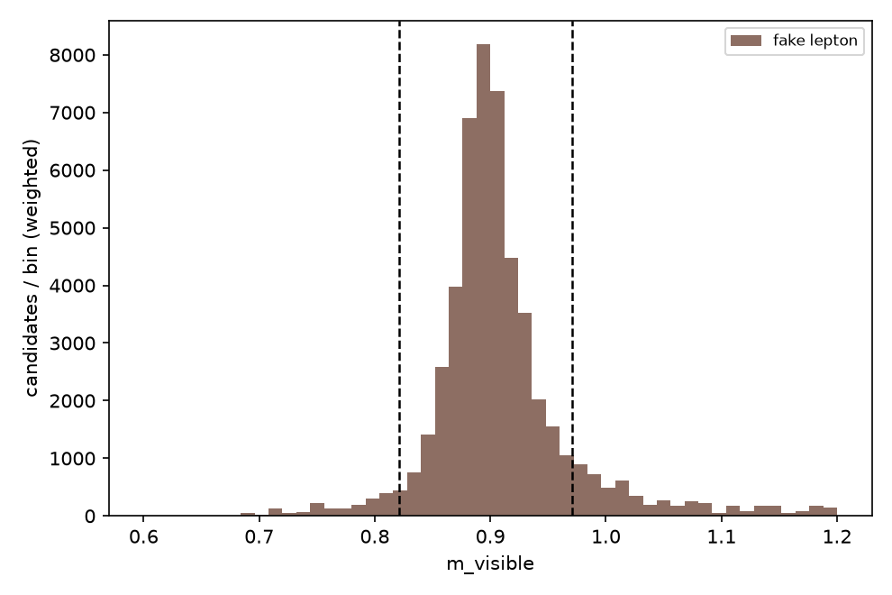
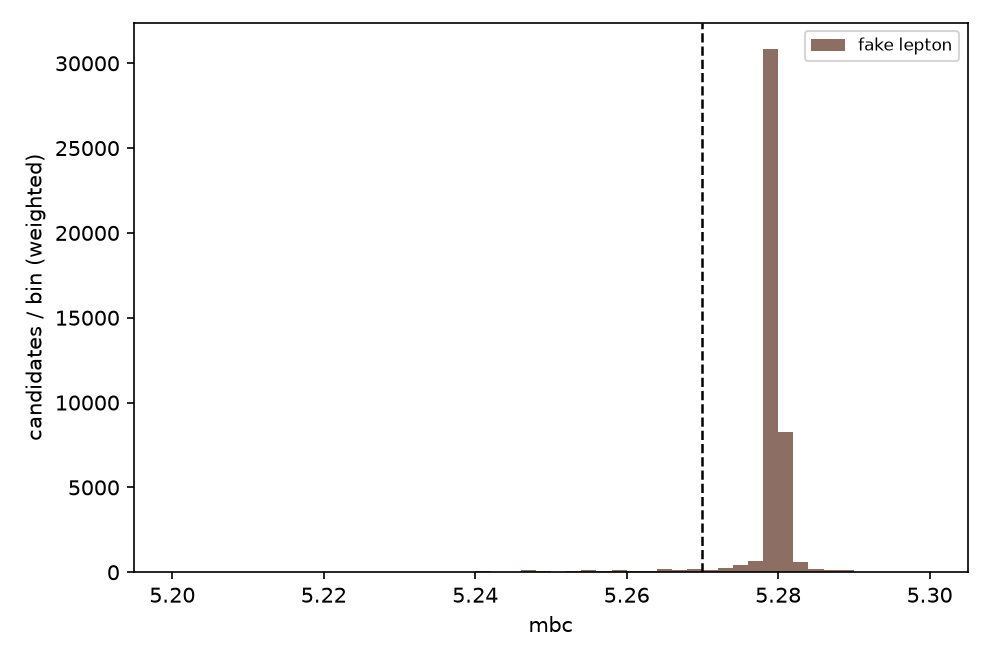
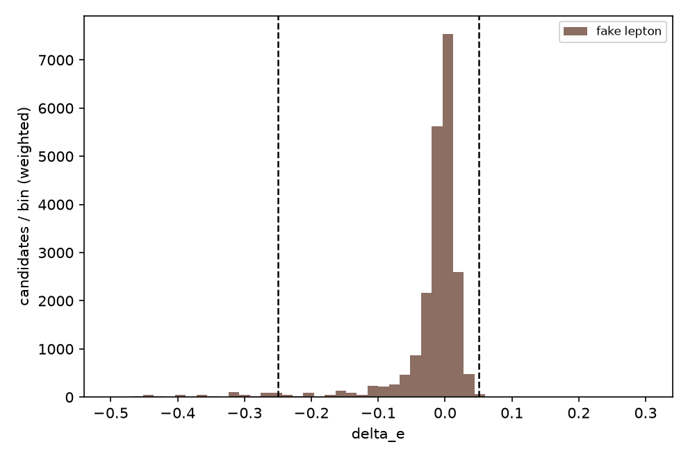
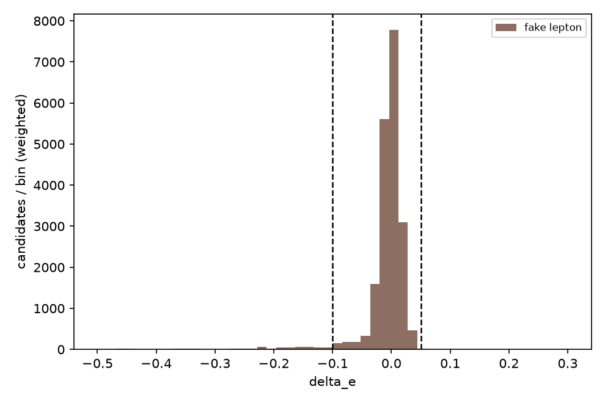
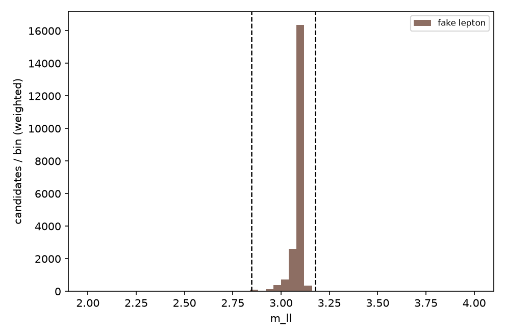
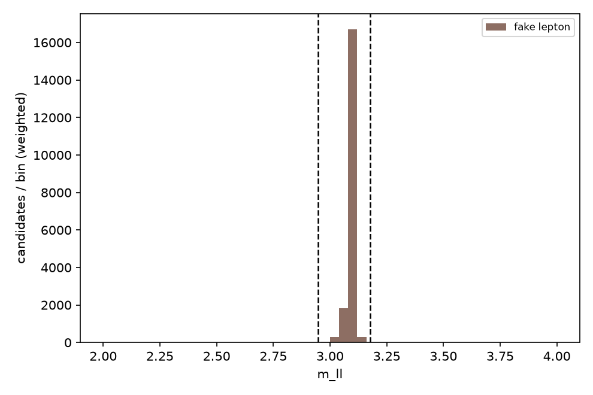

# Sensitivity study: B0 -> K*0(K+pi-) l+l- with a J/psi K*0 peaking background

## 1. Introduction

B0 -> K*0 l+l- (l = e, mu) is a flavor-changing-neutral-current b -> s l+l-
transition, forbidden at tree level in the Standard Model and sensitive to
new heavy particles in the loop. Belle first measured its branching
fraction and forward-backward asymmetry using the beam-energy-constrained
mass Mbc, the energy difference DeltaE, and a K pi invariant-mass window
around the K*(892), with asymmetric charmonium (J/psi, psi(2S)) vetoes in
the dilepton mass that are wider on the low side for electrons because of
bremsstrahlung (Wei et al. [Belle], PRL 103, 171801 (2009)). The
vetoed J/psi K* sample itself served as the control channel for
efficiencies and PID. The most recent Belle II measurement of this same
final state (arXiv:2206.05946) uses the identical strategy and quotes
explicit numerical veto windows,
J/psi excluded at M(mu+mu-) not in [2.946, 3.176] GeV and
M(e+e-) not in [2.846, 3.176] GeV, which this note adopts as the starting
point and validates on its own simulation.

This note reproduces that selection logic on a fast-simulation sample to
estimate the signal yield and statistical precision achievable with
1 ab^-1, and to quantify the size and control-region purity of the
residual J/psi K*0 peaking background after the veto. Continuum and
generic-BBbar combinatorial background are explicitly **not** modeled in
this study (no such samples were generated); this is stated wherever it
matters and discussed in Section 6.

## 2. Data samples and analysis tools

Samples were **not regenerated** for this study; two existing ntuples
(produced by `make_ntuple_exclusive.py`, one row per reconstructed B
candidate) were used directly.

| Sample | Process | Generator model | Events generated | Flavor split | Seeds |
|---|---|---|---|---|---|
| `sig_kstll.root` | B0 -> K*0(K+pi-) l+l- | EvtGen `BTOSLLBALL` | 10000 | 50% e+e-, 50% mu+mu- | 32 / 33 |
| `bkg_jpsikst.root` | B0 -> J/psi(->l+l-) K*0(K+pi-) | EvtGen (J/psi K* + J/psi->ll) | 5000 | 50% e+e-, 50% mu+mu- | 34 / 35 |

Relevant branches: `m_visible` (reconstructed m(K pi), i.e. the K*
candidate mass), `mbc`, `delta_e`, `m_ll` (reconstructed dilepton mass),
`lep_flavor` (11 = e, 13 = mu). These ntuples carry no `true_mode` branch
(unlike the `make_ntuple` output used in other notes of this framework):
truth information here is simply which file a candidate came from.

The events were passed through the framework's fast detector simulation
(track/cluster smearing, lepton and hadron PID) at ntuple-production time;
only ~44-54% of generated events per flavor yield a reconstructed
candidate row in the ntuple (Section 4, "reconstructed" cutflow stage) —
this already includes basic reconstruction/acceptance losses.

**Normalization to 1 ab^-1.** The number of available B0/B0bar mesons is

N(B0 avail) = 2 x f00 x sigma(BBbar) x L = 2 x 0.486 x 1.1 nb x 1e9 nb^-1 = 1.0692e9

using f00 = 0.486, sigma(BBbar) = 1.1 nb, and L = 1 ab^-1 = 1e9 nb^-1.
Per-event luminosity weights (expected events at 1 ab^-1 per generated MC
event, by flavor) are

w = N(B0 avail) x BF(mode) x BF(K*0 -> K+pi-) / N_generated(flavor)

with BF(K*0 ee) = 1.03e-6, BF(K*0 mumu) = 1.05e-6, BF(K*0->K+pi-) = 2/3,
BF(J/psi K*0) = 1.27e-3, BF(J/psi->ll) = 0.0597 (same for e and mu), and
N_generated = 5000 per signal flavor, 2500 per background flavor:

| | w (events / 1ab^-1 per generated MC event) |
|---|---|
| signal, e+e- | 0.1468 |
| signal, mu+mu- | 0.1497 |
| J/psi K*0, e+e- | 21.618 |
| J/psi K*0, mu+mu- | 21.618 |

The huge weight of the J/psi K*0 sample reflects BF(J/psi K*0) being
~1000x larger than the signal BF: the charmonium veto (Section 3.4) must
reject this background very efficiently.

All figures were produced with `plot_stacked` (luminosity-weighted,
truth-split by sample and, where relevant, by reconstructed lepton
flavor via a `lep_flavor` selection). All cut values were fixed with the
`scan_cut` tool, scanning one variable at a time on top of the
preceding cuts, using unweighted MC counts as the figure of merit
S/sqrt(S+B) (a shape-level proxy; the weighted, physical yields are
computed separately in Section 5).

## 3. Event selection

Four sequential cuts are applied, in the same order and with the same
physics motivation as Wei et al. [Belle] and the Belle II K*(892)ll
measurement.

### 3.1 K* mass window (m_visible)

*Targets:* wrong-mass K-pi combinations under the K*(892) lineshape
(natural width 47 MeV) folded with detector resolution. In this
simplified simulation both the signal and the J/psi K*0 background
contain a genuine K*(892), so this cut is a resolution/acceptance cut
rather than a signal/background discriminant — as confirmed by the scan,
where the FOM falls monotonically as the window is tightened for both
samples equally (`scan_cut` on `m_visible`, symmetric window):

| window (GeV) | signal eff. | background eff. |
|---|---|---|
| +-0.05 | 74.8% | 75.7% |
| **+-0.075 (chosen)** | **83.6%** | **83.7%** |
| +-0.10 | 87.8% | 88.4% |

Window chosen: **0.821 < m(K pi) < 0.971 GeV** (0.896 +- 0.075 GeV),
retaining ~84% of both samples while removing the far tails where a real
combinatorial background (not modeled here) would dominate.
Figure: `plots/01_mvisible_presel.png` (cut lines at the window edges).

### 3.2 Beam-energy-constrained mass (Mbc)

*Targets:* combinatorial/continuum background populating low Mbc (not
modeled here) and mis-reconstructed candidates; real signal peaks at the
beam energy. Scan on top of the K* window (`scan_cut`, `mbc`, direction
">"):

| Mbc > (GeV) | S | B | S/sqrt(S+B) |
|---|---|---|---|
| 5.24 | 4103 | 1960 | 52.7 |
| 5.26 | 4048 | 1931 | 52.4 |
| **5.27 (chosen)** | **3999** | **1900** | **52.1** |
| 5.275 | 3953 | 1875 | 51.8 |
| 5.28 | 860 | 425 | 24.0 |

The sharp drop above 5.28 GeV marks the edge of the Mbc peak itself
(beam-energy edge, ~5.29 GeV, smeared by detector resolution); cutting
there would remove signal, not background. **Mbc > 5.27 GeV** is chosen,
following Wei et al., retaining 96% of the K*-window sample.
Figure: `plots/02_mbc_afterkst.png` (cut line at 5.27 GeV).

### 3.3 Energy difference (DeltaE), per lepton flavor

*Targets:* partially reconstructed or extra-energy background; for
electrons the signal itself develops a low-side tail from final-state
bremsstrahlung not fully recovered by clustering, motivating an
asymmetric, wider low-side window (as in Wei et al.). Scans on top of
the K*+Mbc selection, separately per flavor (`scan_cut`, `delta_e`):

Electron channel (lower edge, direction ">"): FOM rises monotonically
as the window is loosened and plateaus around -0.25 to -0.30 GeV
(38.0-38.2), while the upper edge saturates at +0.05 GeV (S stops
increasing beyond that). Chosen: **-0.25 < DeltaE < 0.05 GeV**.

Muon channel: the same scan shows a much smaller low-side tail (FOM
35.2-35.3 essentially flat from -0.10 to -0.30 GeV), consistent with the
absence of bremsstrahlung; the upper edge again saturates at +0.05 GeV.
Chosen: **-0.10 < DeltaE < 0.05 GeV**, a narrower low side than for
electrons, reproducing the qualitative asymmetry reported by Wei et al.

Figures: `plots/03_deltae_ee.png`, `plots/03_deltae_mumu.png` (cut lines

at the chosen edges).

### 3.4 Charmonium (J/psi) veto in m_ll, asymmetric per flavor

*Targets:* B0 -> J/psi(->l+l-) K*0, the dominant peaking background,
~1000x the signal rate before any veto. The trade-off scan
(`scan_cut`, `m_ll`, on top of K*+Mbc+DeltaE, per flavor) brackets the
peak from below and above:

Electron channel, lower edge (keep m_ll < threshold): background stays
at 0-2 events up to 2.9 GeV then rises quickly (11 at 2.95, 30 at 3.0).
Upper edge (keep m_ll > threshold): background jumps from 297 (>3.10,
inside the radiative tail region) to 4 (>3.13) to 0 (>=3.15).

Muon channel, lower edge: background is 0 up to 2.98 GeV, then rises
(7 at 3.02, 26 at 3.05). Upper edge: background jumps from 316 (>3.10)
to 1 (>3.13) to 0 (>=3.15).

Both flavors therefore have a "safe" plateau (background ~0, signal near
its local maximum) that brackets the Belle II window values; these are
adopted as the final veto, confirmed rather than re-derived by the scan:

| flavor | veto window (excluded) |
|---|---|
| e+e- | 2.846 - 3.176 GeV |
| mu+mu- | 2.946 - 3.176 GeV |

Figures: `plots/04_mll_ee_veto.png`, `plots/04_mll_mumu_veto.png`.

## 4. Full cutflow (per flavor, per sample)

Efficiencies are cumulative relative to the number of **generated**
events for that flavor (5000 for signal, 2500 for J/psi K*0 background);
"reconstructed" is the fast-sim reconstruction/acceptance stage already
built into the ntuple.

**Signal, B0 -> K*0 e+e-** (5000 generated)

| stage | N | step eff. | cum. eff. |
|---|---|---|---|
| generated | 5000 | - | 100.0% |
| reconstructed | 2701 | 54.0% | 54.0% |
| K* window | 2268 | 84.0% | 45.4% |
| Mbc > 5.27 | 2138 | 94.3% | 42.8% |
| DeltaE window | 2104 | 98.4% | 42.1% |
| J/psi veto | 1946 | 92.5% | **38.9 +- 0.7%** |

**Signal, B0 -> K*0 mu+mu-** (5000 generated)

| stage | N | step eff. | cum. eff. |
|---|---|---|---|
| generated | 5000 | - | 100.0% |
| reconstructed | 2292 | 45.8% | 45.8% |
| K* window | 1907 | 83.2% | 38.1% |
| Mbc > 5.27 | 1861 | 97.6% | 37.2% |
| DeltaE window | 1819 | 97.7% | 36.4% |
| J/psi veto | 1682 | 92.5% | **33.6 +- 0.7%** |

**Background, B0 -> J/psi(->e+e-) K*0** (2500 generated)

| stage | N | step eff. | cum. eff. |
|---|---|---|---|
| generated | 2500 | - | 100.0% |
| reconstructed | 1295 | 51.8% | 51.8% |
| K* window | 1068 | 82.5% | 42.7% |
| Mbc > 5.27 | 986 | 92.3% | 39.4% |
| DeltaE window | 957 | 97.1% | 38.3% |
| J/psi veto | 2 | 0.2% | **0.08 +- 0.06%** |

**Background, B0 -> J/psi(->mu+mu-) K*0** (2500 generated)

| stage | N | step eff. | cum. eff. |
|---|---|---|---|
| generated | 2500 | - | 100.0% |
| reconstructed | 1101 | 44.0% | 44.0% |
| K* window | 938 | 85.2% | 37.5% |
| Mbc > 5.27 | 914 | 97.4% | 36.6% |
| DeltaE window | 885 | 96.8% | 35.4% |
| J/psi veto | 0 | 0.0% | **0.0% (0/2500)** |

The veto is the only cut that discriminates signal from background
(step efficiency 92.5% for signal vs 0.2%/0% for the J/psi background);
all preceding cuts have essentially equal efficiency on both samples, as
expected since they share the same K* and B kinematics.

## 5. Background estimation

The only background modeled in this study is the residual leakage of
B0 -> J/psi(->l+l-) K*0 past the charmonium veto (Section 3.4); this is
the dominant peaking background identified by Wei et al. and Belle II
for this final state. Continuum e+e- -> qqbar and generic-BBbar
combinatorial background are **not modeled** (no such MC was generated
for this study) — see Discussion.

**Control region.** The J/psi veto window itself (before the veto is
applied) is a natural control region for this background, exactly as
used by Wei et al. and Belle II to calibrate efficiencies. Taking the
candidates in that window after the K*+Mbc+DeltaE cuts and normalizing
to 1 ab^-1:

| flavor | J/psi K*0 yield in window | signal leakage in window | purity |
|---|---|---|---|
| e+e- | 20645 | 23.2 | 99.89% |
| mu+mu- | 19132 | 20.5 | 99.89% |

The control region is essentially pure J/psi K*0 (>99.8%) in both
flavors, confirming it can be used, as in the published analyses, to
calibrate reconstruction/PID efficiency and the Mbc/DeltaE shape of the
peaking background directly from data rather than from simulation.

## 6. Results

Multiplying the final cutflow efficiencies (Section 4) by the total
expected rate at 1 ab^-1 (Section 2) gives the expected yields:

| flavor | S (signal) | B (residual J/psi K*0) | S/sqrt(S+B) | relative stat. unc. sqrt(S+B)/S |
|---|---|---|---|---|
| e+e- | 285.7 | 43.2 | 15.7 | 6.3% |
| mu+mu- | 251.8 | 0.0 (0/2500 MC; 68% CL UL ~ 24.6) | 15.9 (25.2 UL) | 6.3% (6.6% UL) |
| combined | 537.5 | 43.2 | 22.3 | 4.5% |

With zero background MC events surviving the veto in the muon channel,
the point estimate B_mumu = 0 is quoted together with a simple 68%-CL
Poisson upper limit (1.14 raw events, scaled by the muon-channel
weight) to avoid overstating precision from a single MC sample with
finite statistics; a production analysis would use a much larger J/psi
K*0 MC sample to pin this down (see Discussion).

At 1 ab^-1 the study projects order-500 selected signal candidates
split roughly evenly between the two lepton flavors, each with about
6% relative statistical precision on its own, and about 4.5% combined,
neglecting the background not modeled here (continuum, generic BBbar).
This is comparable in scale to the ~40-80 signal candidates reported by
Belle II with 189 fb^-1 (arXiv:2206.05946), scaled up by the larger
1 ab^-1 sample size.

## 7. Discussion

Limitations, ordered by expected impact on a real measurement:

1. **Continuum (e+e- -> qqbar) and generic BBbar combinatorial
   background are not modeled.** In every published B -> K*ll analysis
   these are the leading backgrounds, suppressed with continuum-suppression
   variables (Fox-Wolfram R2, event-shape/BDT discriminants) and fit with
   an ARGUS shape in Mbc plus a linear shape in DeltaE (Wei et al.; Belle
   II arXiv:2206.05946 uses a 2D unbinned Mbc-DeltaE fit rather than pure
   cut & count for this reason). A real analysis would add qqbar and
   generic BBbar MC samples, retrain the K*/Mbc/DeltaE cuts jointly with a
   continuum suppression cut, and extract the yield from a fit rather
   than a simple counting experiment. This is the single largest
   omission and likely dominates the true precision at 1 ab^-1.
2. **psi(2S) veto is not modeled** (no B0 -> psi(2S) K*0 sample was
   generated), even though it is part of the standard published
   selection at a similar M_ll offset from its resonance. Its expected
   rate is smaller than J/psi K*0 (BF(psi(2S)->ll) is smaller and
   BF(B->psi(2S)K*) is also smaller) but should be added for completeness.
3. **Only one J/psi K*0 MC sample size (5000 events)** was available;
   the muon-channel veto efficiency is limited to "0/2500 survive",
   i.e. a background estimate with essentially no MC statistics behind
   it. A production study needs a much larger charmonium-background MC
   sample (or the data control region itself, as in Section 5) to
   quote a reliable central value rather than an upper limit.
4. **No systematic uncertainties were evaluated** (tracking ~0.3%/track,
   lepton PID ~1-2%/lepton, K*/kaon PID, N_BB/f00 ~1-2%, sub-decay BFs,
   all quoted at the level given by Wei et al. and the Belle II analyses
   above). At the ~5-7% statistical precision found here, PID and
   tracking systematics (few %) would already be a relevant, not
   negligible, contribution and should be added in quadrature.
5. **Electron bremsstrahlung is treated only implicitly** through the
   fast-simulation smearing and the wider DeltaE/veto windows; no
   explicit photon-recovery (adding back a bremsstrahlung photon within
   a cone of the electron track) is modeled, unlike in the published
   analyses. This likely means the electron-channel efficiency and
   m_ll resolution near the J/psi edge are optimistic relative to real
   data.
6. **The K* mass window was optimized on samples that both contain a
   genuine K*(892)**, so it could not be tuned against combinatorial
   background as in a real analysis; its value (0.896 +- 0.075 GeV) is a
   reasonable resolution-driven choice but should be re-optimized once
   combinatorial background is modeled.

## 8. Conclusion

Following the selection strategy of Wei et al. [Belle], PRL 103, 171801
(2009) and the Belle II B -> K*(892)l+l- branching-fraction measurement
(arXiv:2206.05946) — a K* mass window, Mbc and DeltaE requirements, and
asymmetric per-flavor J/psi vetoes in m_ll — this study projects, from
existing signal and J/psi K*0 background ntuples reweighted to 1 ab^-1:
about 286 e+e- and 252 mu+mu- signal candidates, with a residual J/psi
K*0 peaking background of about 43 events in the electron channel and
consistent with zero (upper limit ~25 events) in the muon channel. The
resulting statistical precision is about 6% per flavor and 4.5%
combined, neglecting continuum and generic-BBbar combinatorial
background, which are not modeled in this study and would need dedicated
MC samples, a continuum-suppression cut, and a 2D Mbc-DeltaE fit (as in
the cited Belle and Belle II analyses) for a publication-grade result.
The J/psi K*0 control region is confirmed to be >99.8% pure in both
flavors, supporting its use, as in the published analyses, to calibrate
efficiencies directly from data.

## Figures

- `plots/01_mvisible_presel.png` — K pi mass, K* window motivation.
- `plots/02_mbc_afterkst.png` — Mbc after the K* window, Mbc>5.27 GeV cut.
- `plots/03_deltae_ee.png`, `plots/03_deltae_mumu.png` — DeltaE per flavor,
  asymmetric window motivation.
- `plots/04_mll_ee_veto.png`, `plots/04_mll_mumu_veto.png` — dilepton mass,
  J/psi veto per flavor.