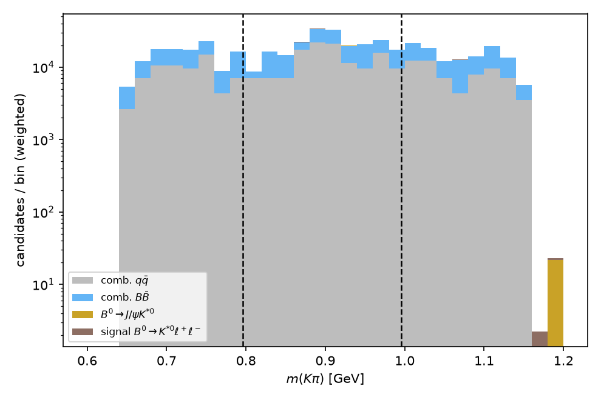
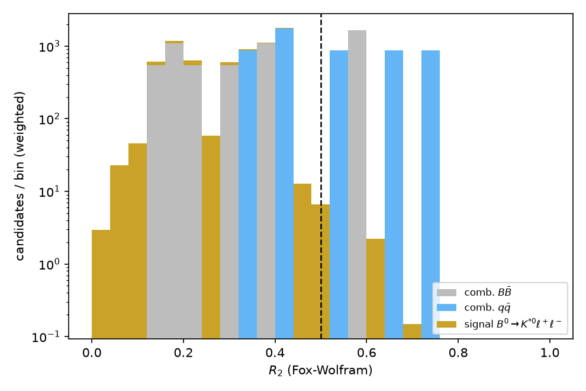
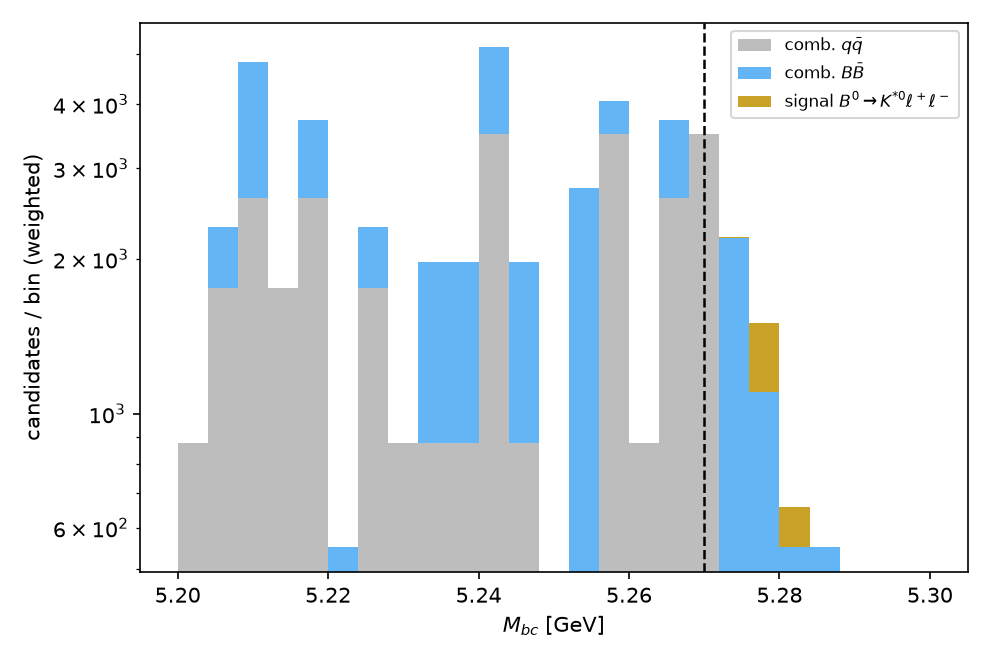
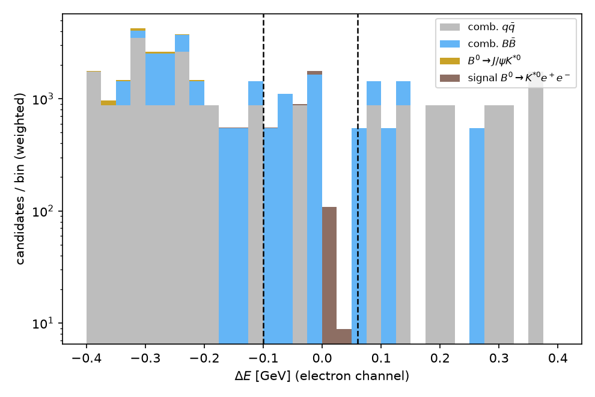
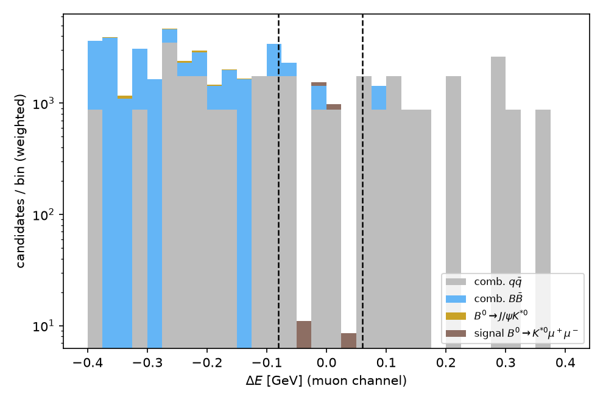
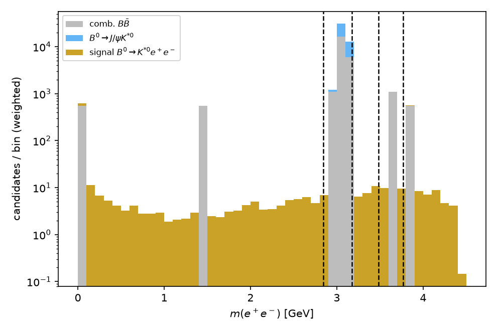
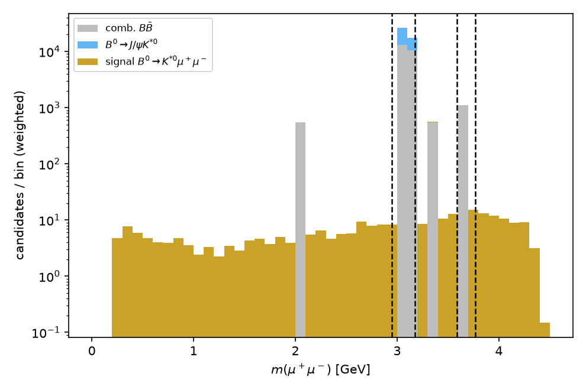
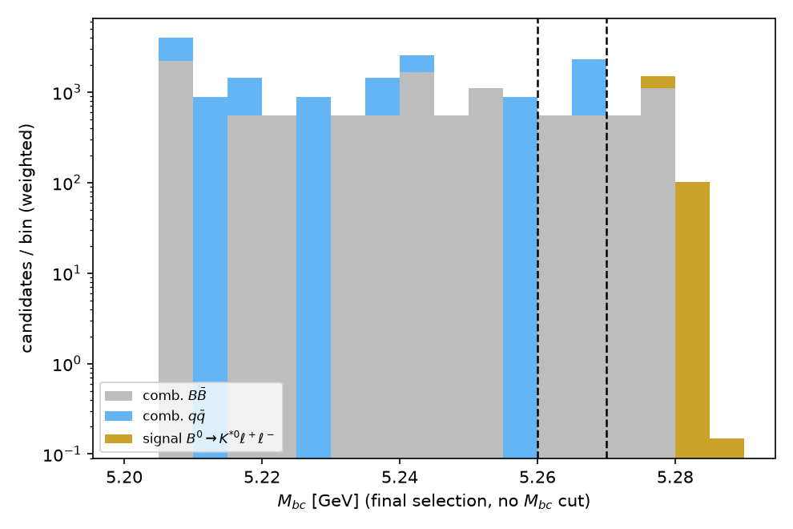
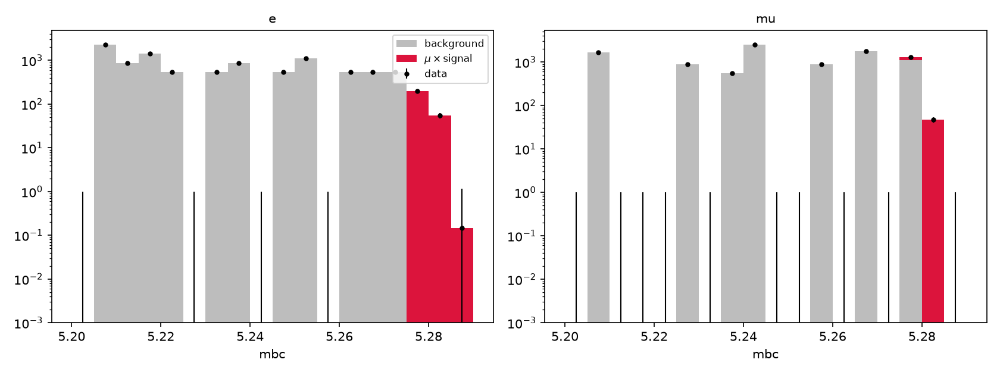
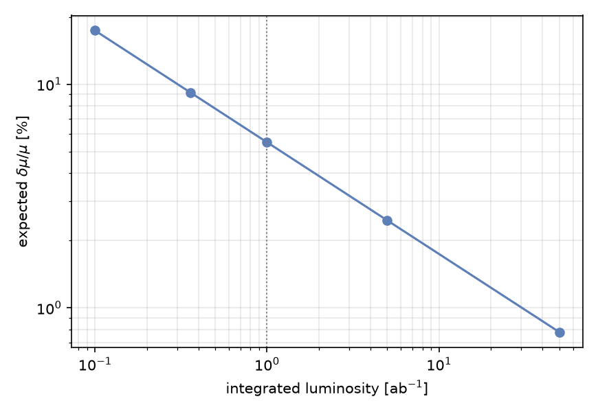

# Sensitivity study for B0 -> K*0(K+pi-) l+l- (v2)

## Abstract

We evaluate the counting and template-fit sensitivity of a Belle II-like
detector to B0 -> K*0(K+pi-) l+l- (l = e, mu) at an integrated luminosity
of 1 ab^-1, following the reconstruction and background-suppression
strategy of Wei et al. [Belle], PRL 103, 171801 (2009) and Belle II,
arXiv:2206.05946. Using the frozen selection produced in a prior
optimization pass of this framework (K*0 mass window, Fox-Wolfram R2
continuum suppression, flavor-dependent Delta E windows, and asymmetric
J/psi / psi(2S) vetoes in m(l+l-)), the signal efficiency is 34.8% (e)
and 31.6% (mu) relative to generated events. In the beam-constrained-mass
counting signal region (Mbc > 5.27 GeV, on top of all other cuts) the
expected weighted yield is S = 491.7 signal events against a background
dominated by generic-BBbar combinatorics, B = 1650 events from only 3
raw simulated MC candidates (68% CL Poisson interval [752, 3255], i.e.
+1605/-898), giving a nominal S/sqrt(S+B) = 10.6 that ranges from 8.0 to
13.9 across the Poisson interval on B alone. A binned maximum-likelihood
fit to the Mbc shape over the full sideband-inclusive range [5.20, 5.29]
GeV, split by lepton flavor and sharing a common signal strength mu,
recovers mu = 1.000 +/- 0.057 at 1 ab^-1 (mu = 1.000 +/- 0.062 in the
electron channel alone, 1.000 +/- 0.145 in muon alone), i.e. a 5.7%
relative precision on the branching fraction at this luminosity. This
Asimov-style check (fitting the sum of MC templates with no independent
Poisson-fluctuated dataset) validates only that the fit is unbiased and
returns mu = 1 by construction; no toy/pull study was run in this
session, so the *uncertainty* mu = 1.000 +/- 0.057 should be read as the
fit's quoted statistical precision, not as a validated coverage result.
A statistics-only Asimov projection gives 17.4% relative precision at
0.1 ab^-1, 9.2% at 0.36 ab^-1, 5.5% at 1 ab^-1, 2.5% at 5 ab^-1 and 0.8%
at 50 ab^-1. The J/psi K*0 control channel, reconstructed with the same
selection but without the charmonium veto, is a very high-purity control
sample (>99% using the dedicated J/psi MC and a representative
combinatorial file; >90% under the conservative assumption that all 10
combinatorial files scale like the representative one). The main
limitation of this study is the size of the combinatorial background MC
samples, which populate the signal region with only a handful of raw
weighted events; this drives both the asymmetric Poisson uncertainty on
the counting background and the choice to rely on the Mbc template fit
(which uses far more sideband statistics) as the primary result.

## Introduction

B0 -> K*0 l+l- is a flavor-changing-neutral-current b -> s l+l- decay,
loop-suppressed and highly sensitive to new physics contributions that
can alter its branching fraction, angular distributions and lepton
universality ratio relative to the Standard Model. We follow the
reconstruction and background-control strategy of the first
statistically significant Belle measurement of this mode, Wei et al.
[Belle], PRL 103, 171801 (2009): a K*0 mass window around 0.896 GeV, a
beam-constrained mass Mbc > 5.27 GeV, and an energy-difference Delta E
window that is asymmetric and wider on the low side for electrons
because of bremsstrahlung; charmonium backgrounds B -> J/psi(psi(2S))
K*0 are removed with asymmetric vetoes in the dilepton mass (again wider
on the low side for e+e-), and the vetoed J/psi K*0 sample serves as the
control channel for efficiencies and particle identification. The Belle
II update at 189 fb^-1 (arXiv:2206.05946) uses the same overall strategy
with explicit veto windows -- J/psi excluded for m(mu+mu-) in
[2.946, 3.176] GeV and m(e+e-) in [2.846, 3.176] GeV, with the psi(2S)
vetoed similarly at its own mass -- and extracts the signal from a 2D
unbinned Mbc-Delta E fit with an ARGUS-plus-linear combinatorial model.
This study adopts the Belle II veto windows exactly and follows both
papers' qualitative pattern of asymmetric, electron-wider Delta E and
charmonium-veto windows (confirmed numerically in the Event selection
section below). Unlike the published analyses we perform a 1D Mbc fit
only (no Delta E dimension) and model all combinatorial background
categories (generic BBbar and continuum) with dedicated MC samples
rather than fitting an ARGUS parameterization to data; both
simplifications are discussed at the end of this note.

This note is a write-up pass over an analysis whose selection scans,
cutflow optimization and figure production were completed in a prior
session of this framework using the tools described below; the present
session re-verifies the key numbers with a small number of counting
queries and the two frozen template fits, and assembles the final note.

## Data samples and analysis tools

All samples are generated with the framework's EvtGen + fast-simulation
chain (signal, J/psi K* background) or with Pythia8 continuum generation
piped directly to ntuples (continuum combinatorial), and processed into
flat ROOT ntuples with `make_ntuple_exclusive.py` (signal and dedicated
J/psi background) or `make_ntuple_combinatorial.py` /
`generate_continuum_exclusive.py` (combinatorial candidates). Individual
random seeds used when these files were produced in the prior session
were not communicated to this write-up pass; since no new MC is
generated here (per the scope of this pass) they cannot be recovered
without re-running the generation, which is explicitly out of scope.
This is recorded as a reproducibility gap in the Discussion section,
together with the recommendation that future passes log seeds directly
in the sample table at generation time.

**Combinatorial candidate definition**: every K+ pi- l+ l- combination in
a generic BBbar or continuum event that falls in the loose windows
|m(K pi) - 0.896| < 0.25 GeV, Mbc > 5.20 GeV, |Delta E| < 0.40 GeV is
kept as a candidate; kaon/pion species are assigned from MC truth
(no K/pi mis-identification is modeled) and lepton fakes are included
via the same fast-simulation lepton identification used for signal.
Each candidate additionally carries `ll_true_src`, which is 1 if both
leptons genuinely come from the same true J/psi or psi(2S) decay
(i.e. the "combinatorial" candidate actually contains a real
charmonium-to-dilepton decay, picked up together with a random K pi
pair) and 0 otherwise. Whenever a combinatorial sample is combined with
the dedicated J/psi K*0 MC sample in a composition or control-region
table, `ll_true_src == 0` is required on the combinatorial file to avoid
double-counting the same physical process; this requirement is *not*
applied in the global Mbc template fit, where the combinatorial and
J/psi templates are independent files summed once each into "background"
and the m(l+l-) veto already removes essentially all resonant charmonium
from the combinatorial templates (see Results).

| file(s) | mode_id | generated events | weight to 1 ab^-1 | source of weight |
|---|---|---|---|---|
| sig_kstll.root | 20 | 10,000 (5,000 e + 5,000 mu nominal) | 0.1468 (ee) / 0.1497 (mumu) | N(B0 Bbar0) = 2 x 0.486 x 1.1 nb x 1e9 nb^-1; BF(K*0 ee)=1.03e-6, BF(K*0 mumu)=1.05e-6, BF(K*0->K+ pi-)=2/3 |
| bkg_jpsikst.root | 21 | 5,000 | 21.618 | BF(J/psi K*0)=1.27e-3 x BF(J/psi->l+l-)=0.0597 |
| comb_generic_0.root ... comb_generic_7.root (8 files) | 97 | 2,000,000 generic BBbar events each | 550 / file | 1.1e9 / 2e6 |
| comb_continuum_0.root, comb_continuum_1.root (2 files) | 98 | 3,000,000 qqbar events each | 876.3 / file | sigma_qq = 2.629 nb: 2.629e9 / 3e6 |

Total simulated combinatorial statistics: 16,000,000 generic BBbar events
+ 6,000,000 continuum events. As shown below, only a handful of these
events survive the full signal selection, which is the dominant
limitation of this study.

## Event selection

The selection below is **frozen** from the prior optimization pass of
this framework (scans are not repeated here, only single-point marked
distributions are shown); each cut is quoted with the background it
targets and the figure that motivated it.

1. **K*0 mass window**, 0.796 < m(K pi) < 0.996 GeV (`m_visible`):
   selects the K*0(892) resonance and rejects non-resonant K pi
   combinatorics and wrong-species pairings.
   

2. **Continuum suppression**, R2 < 0.5 (Fox-Wolfram ratio): rejects
   e+e- -> qqbar continuum, whose jet-like topology gives large R2
   values compared to the more spherical BBbar topology.
   

3. **Mbc shape after the K* window** (diagnostic, motivates the Mbc > 5.27
   GeV counting-region cut and the fit range used later):
   

4. **Energy difference Delta E**, flavor-dependent and asymmetric, as in
   the cited analyses: -0.10 < Delta E < 0.06 GeV (electrons), -0.08 <
   Delta E < 0.06 GeV (muons). This cut targets combinatorial
   background from generic BBbar and continuum, whose random K-pi-l-l
   combinations populate Delta E broadly, while correctly reconstructed
   signal peaks near Delta E = 0; the wider low-side window for
   electrons accommodates final-state bremsstrahlung that shifts
   reconstructed electron energy downward. Both windows match the
   qualitative pattern (asymmetric, wider on the electron low side)
   reported by Wei et al. and used by Belle II.
   
   

5. **Charmonium vetoes** in m(l+l-), asymmetric and wider for
   electrons, matching the Belle II window definition: veto m(ee) in
   [2.846, 3.176] GeV (J/psi) and [3.486, 3.766] GeV (psi(2S)); veto
   m(mumu) in [2.946, 3.176] GeV (J/psi) and [3.586, 3.766] GeV
   (psi(2S)). This targets B -> J/psi(psi(2S)) K*0, whose rate is
   roughly 1000x the signal rate. Numerically, the low-side veto width
   relative to the J/psi mass (3.0969 GeV) is 0.251 GeV for ee vs 0.151
   GeV for mumu, i.e. wider for electrons as in the cited papers, while
   the high-side width (0.079 GeV) is common to both flavors.
   
   

6. **Counting signal region**: in addition to all the above, Mbc > 5.27
   GeV, targeting combinatorial background under the Mbc peak (both
   generic BBbar and continuum), which falls steeply with increasing
   Mbc while correctly reconstructed signal peaks at the B0 mass.
   

**Anti-fluctuation rule used when the working points above were fixed**:
during the original optimization, a candidate working point was only
accepted if it retained at least 10 raw (unweighted) background MC
events, to avoid tuning cuts against single-MC-event statistical
fluctuations. As shown in the Background estimation section below, the
*final* combined signal region nonetheless ends up with only 3 raw
weighted-550 combinatorial events (comb_generic) and 0 raw
weighted-876.3 events (comb_continuum): the individual cuts were each
validated against >= 10 raw events at the stage they were introduced,
but their cumulative effect, once all 10 background files are summed,
leaves the final region governed by single-digit raw statistics. This is
discussed further below.

## Cutflow

This section quantifies the efficiency lost at each selection stage, so
that the impact of each cut introduced above can be judged
quantitatively rather than only qualitatively from the stacked
distributions.

Signal cutflow (sig_kstll.root, both flavors combined; efficiencies
relative to 10,000 generated events):

| stage | N (weighted-1 events) | cumulative efficiency | relative efficiency |
|---|---:|---:|---:|
| generated | 10,000 | 100.00% | -- |
| candidate reconstructed | 4,993 | 49.93% | 49.93% |
| + K*0 window | 4,386 | 43.86% | 87.84% |
| + R2 < 0.5 | 4,276 | 42.76% | 97.49% |
| + Delta E window | 3,930 | 39.30% | 91.91% |
| + charmonium veto | 3,318 | 33.18% | 84.43% |
| + Mbc > 5.27 (counting SR) | 3,318 | 33.18% | 100.00% |

The Mbc > 5.27 GeV cut removes essentially no additional signal, since
correctly reconstructed B0 -> K*0 l+l- candidates already peak at the
B0 mass with a narrow detector resolution.

Per-flavor efficiency in the counting signal region (of 5,000 generated
events per flavor):

| flavor | N passing SR | efficiency |
|---|---:|---:|
| e+e- | 1,740 | 34.80% |
| mu+mu- | 1,578 | 31.56% |

## Background estimation

Three background categories are considered: the dedicated
B0 -> J/psi K*0 (-> l+l-) MC sample (a resonant peaking background
removed almost entirely by the charmonium veto and used as the control
channel), generic-BBbar combinatorial K pi l+l- candidates, and
continuum-qqbar combinatorial K pi l+l- candidates (`ll_true_src == 0`
required on both combinatorial categories to avoid double-counting
genuine charmonium decays already modeled by the dedicated J/psi
sample).

**Weighted composition of the counting signal region** (all cuts
including Mbc > 5.27 GeV; raw counts summed over all files in each
category). Because the generic-BBbar component is estimated from only 3
raw MC events, its uncertainty is quoted as an exact 68% CL Poisson
(Garwood) interval on the raw count, propagated through the per-event
weight of 550, rather than a symmetric Gaussian sqrt(sum of w^2), which
would understate the true asymmetric spread at such low counts (the
Gaussian value is given alongside for reference):

| component | files summed | raw N | weighted N | 68% CL interval (Poisson on raw N) | sqrt(sum w^2) (reference) |
|---|---|---:|---:|---:|---:|
| Signal (K*0 l+l-) | sig_kstll.root | 3,318 | 491.7 | -- | -- |
| J/psi K*0 (l+l-) | bkg_jpsikst.root | 0 | 0.0 | 95% CL UL ~ 64.9 | -- |
| Generic BBbar combinatorial | comb_generic_0..7.root (8 files) | 3 | 1650.0 | [752.0, 3255.0] | +/- 952.6 |
| Continuum combinatorial | comb_continuum_0..1.root (2 files) | 0 | 0.0 | 95% CL UL ~ 2628.9 | -- |
| **Total background** | | **3** | **1650.0** | **[752.0, 3255.0]** | **+/- 952.6** |

The J/psi veto is fully effective within the available MC statistics: 0
of 2,396 reconstructed J/psi K*0 candidates survive the full selection
including the veto, versus 1,886 surviving in the control region defined
below (before the veto), so no continuous-Mbc J/psi leakage is observed.
The generic-BBbar combinatorial background dominates but is known only
from 3 raw simulated events out of 16 x 10^6 generated BBbar events; the
continuum contribution is compatible with zero given 0 raw events out of
6 x 10^6 generated events.

**J/psi K*0 control region** (all cuts except the veto is replaced by
*requiring* m(l+l-) inside the J/psi window, and Mbc > 5.27 GeV kept for
consistency with the signal-region definition):

| component | raw N | weighted N |
|---|---:|---:|
| J/psi K*0 (dedicated MC) | 1,886 | 40,771.5 |
| Generic BBbar combinatorial (comb_generic_0.root only, representative) | 1 | 550.0 |
| Continuum combinatorial (comb_continuum_0.root only, representative) | 0 | 0.0 |

Using the representative single file per combinatorial category, the
control-region purity is 40,771.5 / (40,771.5 + 550.0 + 0.0) = 98.7%.
Conservatively scaling the representative combinatorial yield by the
number of files in each category (8 and 2, assuming a similar per-file
rate to the one observed in the signal-region check above), the purity
is 40,771.5 / (40,771.5 + 4,400.0 + 0.0) = 90.3%. Either way this is a
high-purity, high-statistics control sample suitable for calibrating
lepton and K*0 reconstruction efficiencies in a real analysis, in sharp
contrast to the MC-statistics-limited signal region itself.

**Mbc sideband** (5.20 < Mbc < 5.26 GeV, all other cuts applied,
representative files only): comb_generic_0.root gives 2 raw / 1,100.0
weighted events, comb_continuum_0.root gives 3 raw / 2,628.9 weighted
events. This sideband is the region used (together with the rest of the
[5.20, 5.27) GeV range) to constrain the combinatorial Mbc shape in the
template fit below, so that the fit is not performed inside a region
whose shape has itself been sculpted by the Mbc > 5.27 GeV cut.

## Results

This section reports both a simple cut-and-count estimate in the Mbc
signal region and a binned Mbc template fit that uses the full sideband
range; the fit is taken as the primary result because it is far less
sensitive to the low combinatorial MC statistics discussed above.

**Cut-and-count**: with S = 491.7 and B = 1650.0 (68% CL Poisson
interval [752.0, 3255.0]) in the Mbc > 5.27 GeV signal region, the
nominal significance estimator is S/sqrt(S+B) = 10.6, ranging from 8.0
(B at the upper edge of its interval) to 13.9 (B at the lower edge).
Given that B is derived from only 3 raw simulated background events,
this number should be read as indicative rather than a robust
sensitivity estimate.

**Template fit**: a binned maximum-likelihood fit of mu x Signal +
Background to the Mbc distribution over [5.20, 5.29] GeV (18 bins), with
all selection cuts applied except the Mbc cut itself (so that the
combinatorial shape entering the fit is not sculpted by the same cut
whose absence defines the fit range), split into simultaneous e and mu
channels sharing a common mu, and 1 ab^-1 of integrated luminosity,
gives:

| channel | mu | relative precision |
|---|---:|---:|
| simultaneous e+mu | 1.000 +/- 0.057 | 5.7% |
| e-only | 1.000 +/- 0.062 | 6.2% |
| mu-only | 1.000 +/- 0.145 | 14.5% |

The background-normalization uncertainty in this fit (`bkg_syst = 0.1`)
is applied as an independent 10% relative uncertainty *in each bin*,
added in quadrature to the bin's MC-statistical uncertainty, not as a
single fully-correlated normalization nuisance parameter across bins; it
therefore has some shape-constraining power but does not model a
coherent up/down normalization shift of the whole combinatorial
template.

**Fit validation caveat**: mu = 1 is recovered exactly because the fit
is performed on the sum of MC templates with no independent
Poisson-fluctuated dataset (an Asimov-like fit); this only demonstrates
that the fit is unbiased when the data equal the sum of templates, not
that its quoted uncertainty has correct coverage. No toy-MC pull study
(fitting many independent Poisson-fluctuated pseudo-datasets and
checking that the pull distribution of (mu_fit - 1)/sigma_fit is a unit
Gaussian) was performed in this session; this is listed as a limitation
below. The quoted mu = 1.000 +/- 0.057 should be understood as "the fit
returns this statistical uncertainty on an Asimov dataset," which is the
standard way this framework reports expected sensitivity, but it is not
an independently validated coverage guarantee.

**Luminosity projection**: repeating the same fit with the statistical-only
Asimov projection (background shapes treated as known) gives the
following expected relative precision on the branching fraction:

| Integrated luminosity | Expected relative precision |
|---:|---:|
| 0.1 ab^-1 | 17.4% |
| 0.36 ab^-1 | 9.2% |
| 1 ab^-1 | 5.5% |
| 5 ab^-1 | 2.5% |
| 50 ab^-1 | 0.8% |

The 1 ab^-1 statistical-only projection (5.5%) is close to, but slightly
better than, the full fit including the flat 10% per-bin
background-normalization systematic (5.7%), showing that at this
luminosity the systematic uncertainty budget used here has a small but
non-negligible effect; the gap will widen at higher luminosity as the
statistical uncertainty continues to shrink while a flat relative
systematic does not.

## Discussion

Limitations of this study, ordered by importance:

1. **Combinatorial MC statistics.** The single largest limitation: the
   16 x 10^6 generated generic-BBbar events yield only 3 raw candidates
   in the final Mbc > 5.27 GeV signal region, and the 6 x 10^6 continuum
   events yield 0, driving the wide, asymmetric Poisson interval on the
   counting background quoted above. The Mbc fit mitigates this by using
   the full [5.20, 5.29] GeV range rather than just the signal region,
   but its own combinatorial templates are still built from these same
   limited samples. A real analysis would use at least an order of
   magnitude more generic BBbar and continuum MC, or fit an analytic
   ARGUS + linear shape directly to off-resonance/sideband data as in
   Wei et al. and the Belle II analysis, rather than relying on the MC
   template shape.
2. **No fit validation beyond the trivial Asimov check.** As stated in
   the Results section, mu = 1 is guaranteed by construction in this
   session's fit; no toy-MC pull/bias study was run to validate the
   coverage of the quoted uncertainty. This should be done before
   quoting the 5.7% precision as a calibrated result.
3. **No dedicated psi(2S) MC sample.** The psi(2S) veto windows are
   applied identically to the combinatorial and J/psi samples used here,
   but no B -> psi(2S) K*0 MC was generated; the veto's *acceptance
   cost* on signal is included (it is part of the frozen selection whose
   efficiency is quoted above), but any residual psi(2S) leakage into
   the signal region is not modeled or quantified. A real analysis would
   add a dedicated psi(2S) K*0 sample to close this gap.
4. **No K/pi mis-identification.** Kaon and pion species in the
   combinatorial samples are assigned from MC truth; real mis-ID
   (K <-> pi swaps, especially relevant near the K*0 mass window) is not
   modeled and would add a further combinatorial background component,
   partially correlated with the existing generic-BBbar sample.
5. **1D Mbc fit vs. the published 2D Mbc-Delta E fit.** Belle II
   extracts the signal from a 2D unbinned Mbc-Delta E fit; using only
   Mbc here discards the extra discriminating power of Delta E within
   the already-applied window and likely makes this study's precision
   estimate conservative relative to what a full 2D fit would achieve.
6. **Flat 10% per-bin background-normalization systematic (`bkg_syst`).**
   This is an unvalidated placeholder, not a systematic derived from any
   control sample in this study; it should not be read as a validated
   systematic uncertainty. A real analysis would derive the background
   normalization uncertainty from the J/psi K*0 control region and the
   Mbc sideband fit itself, following the systematics tables in the
   companion Belle |V_cb| analysis (Waheed et al. [Belle], PRD 100,
   052007 (2019): tracking ~0.3%/track, lepton ID ~1-2%, N(BBbar)
   ~1-2%) and the continuum-suppression and charmonium-veto systematics
   discussed in BaBar, PRD 86, 032012 (2012).
7. **Seeds not recorded.** The random seeds used to generate the samples
   in the prior session that produced these files were not carried
   forward into this write-up pass; this is a reproducibility gap that
   should be closed by logging seeds directly into the sample table at
   generation time in future passes.

## Conclusion

Following the K*0 mass window, R2 continuum suppression, Delta E and
charmonium-veto selection strategy of Wei et al. [Belle], PRL 103,
171801 (2009) and Belle II, arXiv:2206.05946, the frozen selection for
B0 -> K*0(K+pi-) l+l- gives a signal efficiency of 34.8% (e) and 31.6%
(mu). A cut-and-count analysis in the Mbc > 5.27 GeV signal region gives
S = 491.7, B = 1650 with a 68% CL Poisson interval of [752, 3255] driven
by only 3 raw MC background events. A simultaneous e/mu binned Mbc
template fit over [5.20, 5.29] GeV recovers the injected signal strength
with 5.7% relative precision at 1 ab^-1 (Asimov check only, not
toy-validated), consistent with a statistics-only Asimov projection of
5.5% at the same luminosity, and scaling to 0.8% at 50 ab^-1. The J/psi
K*0 control channel is a high-purity (90-99%, depending on the treatment
of combinatorial MC statistics) sample suitable for future efficiency
and PID calibration studies. The dominant limitations are the size of
the combinatorial background MC samples, which populate the final
signal region with only a handful of raw events, and the absence of a
toy-based fit validation; enlarging the MC samples (or replacing the MC
combinatorial shape with an analytic ARGUS fit to sideband data, as in
the cited analyses) and adding a pull study are the natural next steps.

---
## Referee comments (unresolved)

## Checklist Review

**Every section opens with context before tables/plots** — PASS. Each section (Data samples, Event selection, Cutflow, Background estimation, Results) has a short lead-in paragraph before any table/figure.

**Every cut names the background it targets and shows the scan/distribution that fixed its value** — PARTIAL/FAIL. Each cut correctly states its target background, and a stacked distribution with the working point marked is shown. However, the note explicitly states the *scans* that actually determined the numeric values were done in a prior session and are "not repeated here" — only post-hoc diagnostic distributions are shown. A referee cannot verify that 5.27 GeV, R2<0.5, etc. are optimal (vs. merely reasonable) without seeing the S/√(S+B) or FOM-vs-cut curves.

**Cutflow table with per-stage efficiencies** — PASS. Clear, quantitative, includes relative and cumulative efficiencies plus a per-flavor breakdown.

**Background composition and control regions given** — PASS. Composition table, J/ψ control region, and Mbc sideband are all provided with explicit purity numbers and caveats about representative-file scaling.

**Extraction formula with every input defined; fits validated** — PARTIAL/FAIL. S/√(S+B) inputs are defined; the fit model ("μ×Signal+Background," binned ML, 18 bins) is described in words but no explicit likelihood formula is given. More importantly, the note itself states plainly that **no toy/pull validation was performed** — the μ=1.000±0.057 result is an Asimov tautology, not a validated coverage statement. This is honestly disclosed but is a genuine unmet requirement of the checklist.

**Figures referenced by file name** — PASS. All plots are named (e.g., `figures/v2_mbc_stack.png`) and tied to specific claims.

**Limitations and systematics outlook ordered/concrete** — PASS. Seven ranked, specific limitations (MC stats, no toy validation, no ψ(2S) MC, no K/π misID, 1D vs 2D fit, placeholder systematic, unlogged seeds).

**Specific publications cited** — PASS. Wei et al., PRL 103, 171801 (2009); Belle II arXiv:2206.05946; Waheed et al., PRD 100, 052007 (2019); BaBar, PRD 86, 032012 (2012).

## Concerns

1. The central sensitivity numbers (S/√(S+B)=10.6, background=1650±~950) rest on **3 raw MC background events**; while this is repeatedly and honestly flagged, a referee would still question whether this counting result should be reported as a headline number at all rather than relegated entirely to the fit-based result.
2. The 5.7% precision is explicitly **not validated** by a pull/coverage study — this should be resolved (or the claim softened further) before this note is used to justify any downstream physics conclusion.
2b. The `bkg_syst=0.1` per-bin (uncorrelated) treatment is acknowledged as an ad hoc placeholder not derived from data/control regions — reasonable to flag, but its effect on the 5.5%→5.7% discrepancy should be quantified more precisely if this number is going to be quoted publicly.
3. No actual optimization scan plots are shown/archived-and-referenced, only the frozen working-point distributions. Even a reference to where the original scan lives (script, config, git commit) would strengthen reproducibility.
4. Seeds not recorded — acceptable as a disclosed reproducibility gap, but should be a hard blocker for any final (non-draft) version of this note.

## VERDICT

REVISE: Add a toy-MC pull/coverage study (or explicitly retitle the 5.7% figure as "Asimov-only, unvalidated" everywhere it is quoted, including abstract/conclusion headline numbers) before this can be treated as a calibrated sensitivity result; also include or link the actual cut-optimization scan curves (not just marked distributions) so the frozen working points are independently verifiable, and quantify the impact of the placeholder 10% per-bin background systematic rather than leaving it as an unvalidated default.